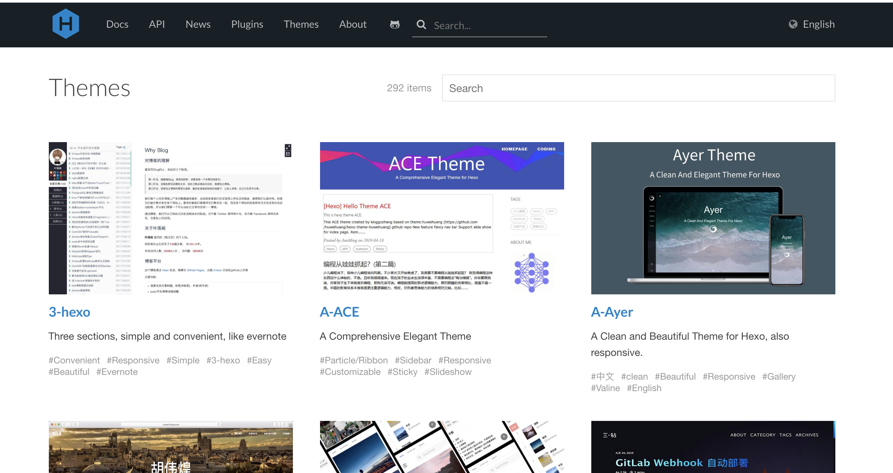
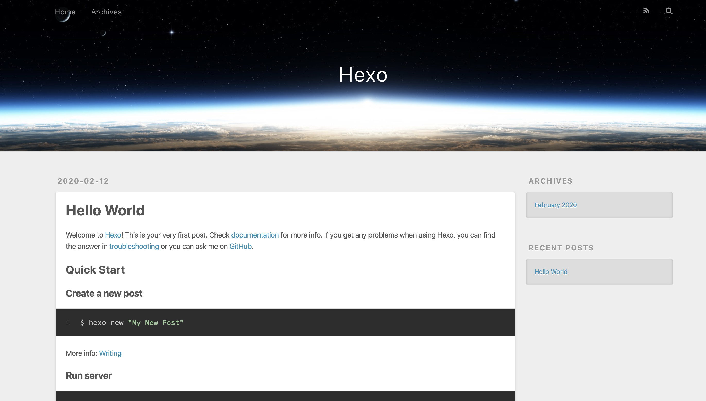
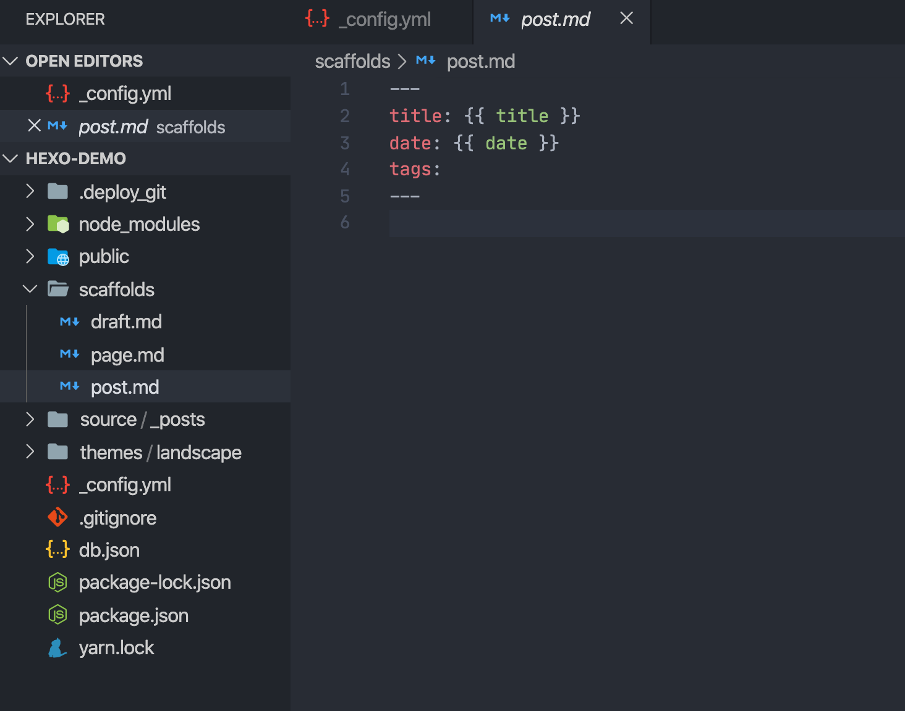
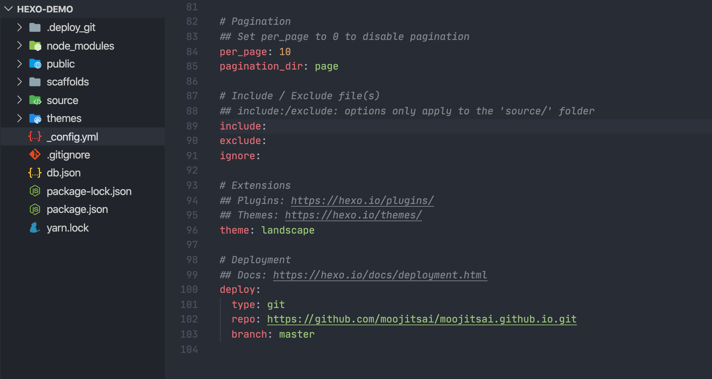
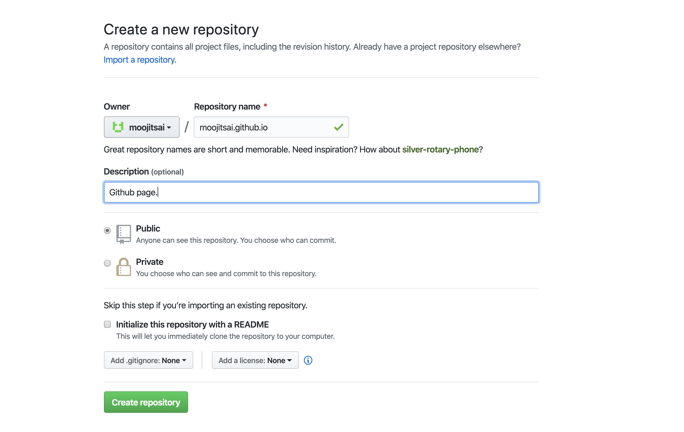
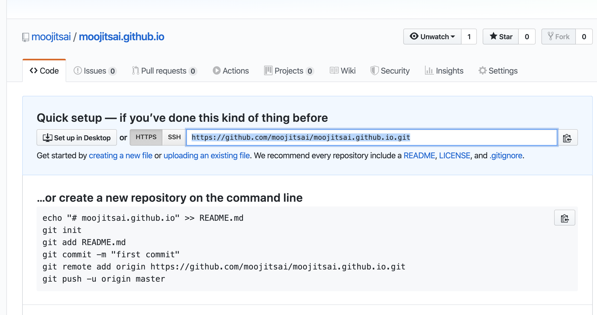
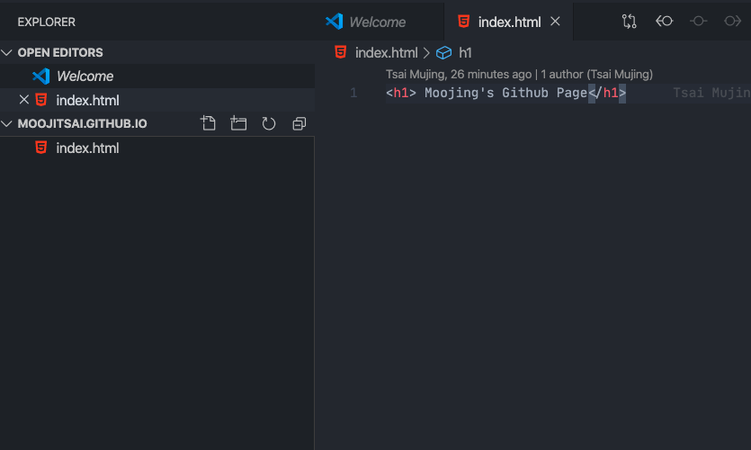
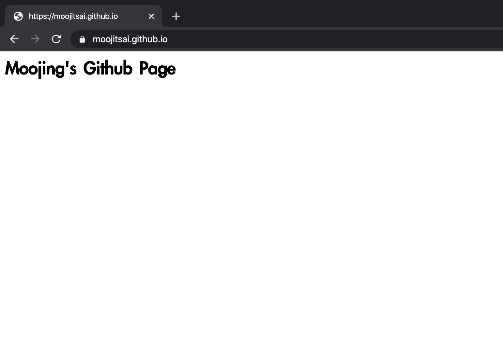

這是我參加[六角全馬鐵人挑戰的第二週](https://www.hexschool.com/2019/11/14/2019-11-14-w3Hexschool-2020-challenge/?fbclid=IwAR2jnd1zwQf14xWUK4J2DztB4XpkkALumb0VS3jSjMKvkqFUhP9xlTICAeU)，在比賽的一開始，就讓我來分享如何在 Github Page 上面架設自己的個人頁面，並串上自己購買的網域名稱（如果有的話）。相信各位工程師們多少都會聽過或看過其他工程師們使用 [Medium](https://medium.com/@moojing) 當作自己的部落格，對其他人分享自己經歷及技術，或是成長過程中領悟到的見解。

但如果你想對這個屬於自己的空間有更高的掌握度，或是想做一些比較客製化的排版視覺，那麼架設[個人專屬的部落](https://www.muji.dev/)會是一個不錯的選擇。因此這邊推薦使用 [Hexo](https://hexo.io/zh-tw/docs/) ，作為今天介紹的主角。當然，方法沒有絕對，你也可以選擇自己從零開始開發，但我認為工程師的職涯如此漫長，有很多問題等我們解決，因此在適當的時機使用適合的工具，有時候是必要的。

## Outline

- Hexo 介紹及專案建置
- Hexo 專案架構
- Github Page
- 將 Hexo 專案部署到 Github Page 上
- 總結

## Hexo 介紹及專案建置

Hexo 是一套可以快速幫你建置個人部落格的工具，在官方提供的[頁面](https://hexo.io/themes/)你可以找到很多別人做好的部落格模板，並直接套用到自己的專案。



首先讓我們先把 hexo 的建置工具裝到系統內，使用以下指令：

    ```bash
        npm install -g hexo-cli
    ```

之後就可以利用 hexo 指令創造一個新的部落格專案。

    ```bash
        npm init \<要創造的 Hexo 專案資料夾名稱\>
    ```

接下來進入剛剛建好的專案資料夾再用這個指令把 hexo 本地測試 server 架起來。

    ```bash
        hexo server 或 hexo s
    ```

沒錯，這樣一來在本地就可以看見即時的變更囉，很方便吧！



## Hexo 專案結構

這邊先介紹一下 Hexo 的資料夾分佈，以及功能。首先在根目錄可以看到幾個比較重要資料夾：

- **public** : 存放編譯後的靜態 html 檔案，基本上不會需要改動裡面的內容
- **scaffolds** : 存放文章模板的地方，新增文章的時候可以選擇要用哪一種模板，以我為例，在寫 JS 文章跟後端 Ruby on Rails 文章的時候就可以用不同模板來產生不同分類與不同標籤的文章，不用每次都另外再改。使用模板來新增文章的參考指令：

  ```bash
      hexo new [Scaffold Name]  [Article Name]
  ```

  

- **source** : 存放部落格文章原始檔案， Hexo 內的文章通常以 Markdonw 來表示內容，而 Markdown 在很多地方都通用，非常方便。
- **themes** : Hexo 官網可以選擇許多別人做好的主題，在官網找到喜歡的主題後，就可以下載並放到這個資料夾，然後記得在根目錄的 `_config.yml` 檔案裡的 theme 設定改為對應的主題名（資料夾名稱） ，以這個範例來說就是 landscape ，而對應的主題資料夾裡面則包含了外觀相關的原始碼（如 HTML / CSS / JS)，建議在必要的時候再去修改這些原始碼，否則盡量修改對應主題資料夾裡面的 `_config.yml` 檔案（與根目錄的同名設定檔不同）會比較好。



## Github Page

什麼是 Github Page ？ 在對 Hexo 專案內容有了基本的了解後，讓我們繼續往下看。 Github Page 是 Github 提供的、能讓開發者利用 git 的形式直接配置好靜態頁面的功能，非常好用，許多實驗性的作品或專案也都會透過這樣的方式來呈現，而今天我們就會嘗試將 Hexo 用 Github Page 的方式來作部署。

首先在 Github 上創建一個新的 Repository ，Repository 的名字依照[官方說明](https://pages.github.com/)，必須遵循以下規則

( 記得 `username` 是你自己的 Github 帳號，不要輸入錯了 )：

    ```bash
        \<username\>.github.io
    ```



然後就會得的一個新的 Repository ，待會我們 Github Page 就會是以這個 Repository 的內容為主來做對外顯示。



其實剛剛輸入的 Repository 名稱 `<username>.gtihub.io` 就會是你個人 Github Page 的網址，可以直接透過瀏覽器輸入網址找到，但因為目前還是空的，所以還不會有東西，我們先在電腦本地將這份 Repository clone 下來 :

    ```bash
        https://github.com/moojitsai/moojitsai.github.io.git
    ```

並新增 `index.html` 檔案做個測試，因為 Github 預設會去尋找這個檔名的檔案作為進入點。



新增完成後只要再用 `git push` 推回剛剛的 Repository 上，就會有 index.html 檔案，應該就可以從你的個人 Gtihub Page 網址看到了（如果沒有看到再來問我）。



## 將 Hexo 專案部署到 Github Page 上

建立完新 Gtihub Page 後，我們來看看怎麼把這整個部落格專案放到 Github Page 上面，其實不難， Hexo 大多幫你做好了，只要設定檔配置正確就沒問題。

首先找到 `_config.yml` 這個檔案，然後在 `deploy` 這個設定下輸入你對應的 Github Page 的 Repo 位置，並把 `type` 寫為 `git` ，就完成基本設置了：


然後在部落格專案目錄底下裝上官方提供的 Git 部署套件 `hexo-deployer-git`：

```bash
   npm install hexo-deployer-git --save
```

最後因為我們文章內容並不是網頁可以直接看得懂的格式，像文章內容就是用 Markdown 來撰寫，所以在部署上 Github 之前我們要先產生部落格專案所需要的靜態檔，使用以下指令來產生：

```bash
    hexo generate 或是 hexo g
```

完成後就可以部署了：

```bash
    hexo deploy 或 hexo d
```

## 總結

 今天的內容主要是紀錄部落格架設的過程，因為當初在使用 Hexo 的某些設定及功能時，某些官網寫的資料並不是那麼明確，還是要自己實驗過或是去看原始碼才比較會知道怎麼做，因此還是寫了一篇文章記錄下來，順便分享給有興趣的各位，下一篇要分享的是如何把今天設置完放到 Github Page 的網頁與自己購買的域名做串接，應該會蠻有趣的！可以先看看我最近串好的域名： <https://www.muji.dev>

## 參考文章

[Hexo 官網](https://hexo.io/docs/)

[Managing a custom domain for your GitHub Pages site](https://help.github.com/en/github/working-with-github-pages/managing-a-custom-domain-for-your-github-pages-site)

[Github Page 說明](https://pages.github.com/)
