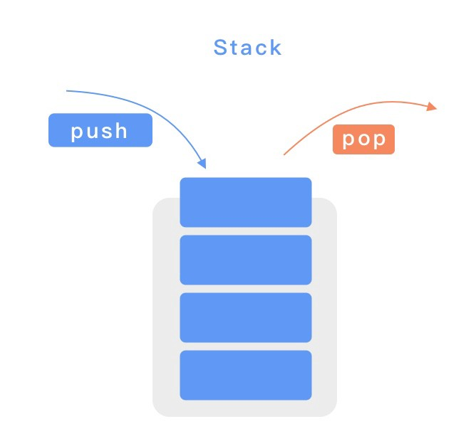
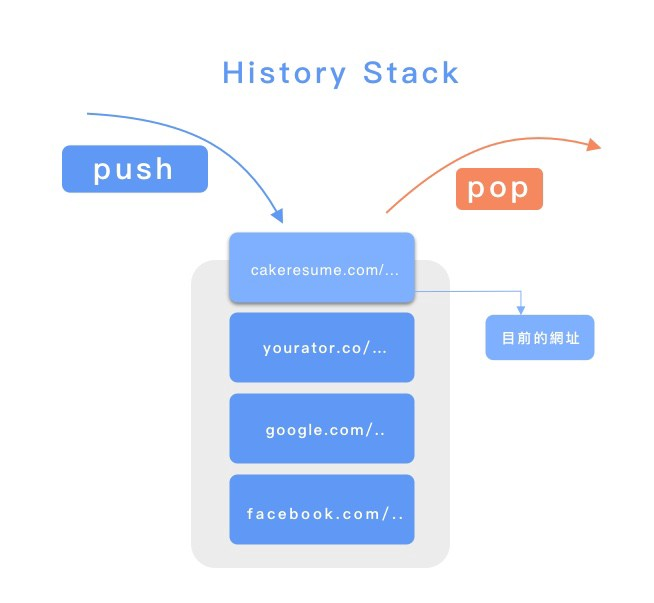
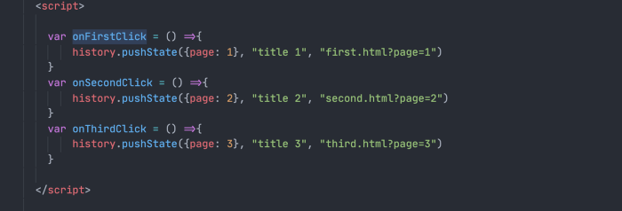

或許 `pushState` 與 `replaceState` 這兩個方法你可能沒聽過，但是瀏覽器「上一頁、下一頁」功能你一定不陌生，其實這兩個 API 是瀏覽器提供給開發者操作瀏覽紀錄用的，透過這兩個 API 並搭配事件處理，我們就可以將瀏覽器預設的「上一頁下一頁」修改成我們想要的客製化結果。

- 使用情境說明
- pushState / replaceState 與點擊新連結有什麼不一樣
- pushState / replaceState 與 Stack 結構
- pushState / replaceState 使用方式
- onpopstate 事件
- 一個栗子

## 使用情境說明

最近接到了必須修改瀏覽器歷史紀錄行為的需求，所以順便寫了篇文章整理下來。 在公司負責的產品是類似 AWS 那樣資源控制的後台介面，前端部分雖然使用了 React 作為主要工具，但架構上有點像是由 Webpack 打包出靜態檔， 之後交由後端 Server 來處理前端內容，所以無法直接將路由控制交給 React 作使用。


什麼意思？一般 SPA 原理是由 JS 產生動態內容並即時掛到 DOM 上，但這個產品流程上是這樣：

1. 在開發階段由 Webpack 將源碼打包成瀏覽器看得懂的程式碼，一個工具模組對應一個頁面
2. 在產品運行階段由 Node Server 來處理剛剛 Webpack 打包好的靜態檔案
3. 因此除非在後端做更詳細的路由修改，否則無法作更複雜的路由變化（ex.巢狀路由）

而在這種情況下如果某一工具模組需要以多個頁面來進行資料的設定流程，就沒辦法像一般我們所習慣的使用框架的 Router 函式庫 — React-Router 或是 Vue-Router 讓路由與頁面動態地做搭配，因此 `pushState` 及 `replaceState` 這兩個 API 就特別適合這個時候拿出來使用。 （可能還是可以，只是在當時沒有太多時間做調查的情況下，我當下所做的決定就是使用這兩個 API 來解決）

首先讓我們先來了解 `pushState` 與 `replaceState` 在做什麼事情。

## pushState / replaceState 與點擊連結有什麼不一樣

兩種方式都會改變瀏覽器網址列的內容，但 pushState 與 replaceState 差別在於**會不會發送新的 Http Request**，不過這點應該不難發現，一般我們點擊新連結時，因為會發送 Request ，對後端重新要求一份的 HTML 內容，因此這個時候會看到瀏覽器重新刷新了頁面。

相對的 pushState 與 replaceState 這兩個 API 則單純只會修改網址列的內容，而不會刷新頁面，只是如果使用者在網址列按下 Enter 或重新整理的話，就一樣會發出 Request 。這與單純點擊的效果相同。

## 瀏覽器記錄與 Stack 結構

關於今天提到的兩個 API，如果查詢 JS 的 MDN 文件的話，關於 `pushState` 會得到以下的說明：

> In an HTML document, the history.pushState() method adds a state to the browser’s session history stack.

而 `replaceState` 則是 :

> The replaceState() method modifies the current history entry, replacing it with the state objects, title, and URL passed in the method parameters.

讀完這兩段雖然可能沒辦法馬上弄清楚說明的意思，但從內容我們可以看到一個蠻重要的部分：「 **history stack.** 」這是否說明瀏覽器記錄與資料結構裡的堆疊 ( Stack ) 有關？沒錯，瀏覽器裡的歷史紀錄就是以堆疊的形式儲存下來供使用者作使用，首先讓我們來看看堆疊是什麼，可以看看以下的模型圖。



我們可以使用 `push` 與 `pop` 兩種方法分別對堆疊結構加入一筆新的資料或是取出最後一筆資料，因此，關於堆疊有一個很常見的描述就是「先進後出」。其他前端常用到的資料結構可以參考我之前[鐵人賽的文章](https://ithelp.ithome.com.tw/articles/10227662)。



所以堆疊套用在歷史紀錄上是怎麼回事呢？每當我們從同一個頁面點擊網址轉到新的頁面時，就是在對歷史紀錄的堆疊使用 `push` 方法新增一筆新的瀏覽紀錄 ，而當我們執行上一頁往前瀏覽時，就像是在使用 `pop` 方法取出最後一筆瀏覽紀錄（網頁位置）。

## `pushState` / `replaceState` 使用方法

```js
history.pushState(state, title, url)
```

現在讓我們回到這兩個 API 上 ， `pushState` 與 `replaceState` 兩個 API 都屬於瀏覽器全域物件 history 底下的屬性，在 history 物件底下還有很其他屬性，如 `history.length`，但今天我們主要討論這兩個方法，這兩個方法都接受三個參數，分別是：

- `state` :每個 history stack 都會可以給一個 state 物件。
- `title` : 更新後頁面的 title 標籤內容設定，不過根據官方文件說明，目前為止大部分瀏覽器都會忽略他，因此最安全的方法是傳入空字串，不做任何修改。
- `url` : 執行該方法後想要更新的 url

但是這兩個長得這麼像的方法在使用上有什麼不ㄧ樣呢？首先，前面提到這兩個 API 都只會更改網址列內容而不會發出新的 Request (刷新頁面)，而它們在使用上其實也差不多，差別在**改變歷史紀錄堆疊的方式**而已。

`pushState` 在被呼叫之後會真的對瀏覽歷史紀錄堆疊新增一筆紀錄，所以如果用 `console.log` 把 `history.length` （歷史紀錄堆疊的長度）印出來看的話會發現長度多了 1。

而 `replaceState` 在呼叫後雖然ㄧ樣會改變網址列內容，但 `history.length` 的值卻不會有任何改變，這是因為如果用堆疊的方式來看歷史紀錄的話， `replaceState` 只會修改堆疊的最後一筆紀錄內容，也就是目前的網址列內容。

## onpopstate 事件

在瀏覽器上一頁按鈕被執行時，堆疊的最上層，也就是最後一筆瀏覽紀錄會被取( pop ) 出，新的一筆紀錄網址會被更改到網址列內，而這時會觸發瀏覽器的內建事件 — `popstate` 事件。所以如果有些客製化功能想要搭配上一頁按鈕執行，就可以使用這個事件。使用：

```js
window.onpopstate  = ( event ) =>; { //事件函式內容 }
```

就可以寫入自訂的事件內容。

## 一個栗子

說了這麼多，來舉個實際的例子看看運作方式如何吧，現在我有三個按鈕，每個按鈕點擊後各自會呼叫有不同參數的 `pushState` 方法，而這時因為是第一次進入頁面，所以 `history.length` 是 1 。




所以如果我依序點擊 first 、second 、 third 按鈕之後，應該會在瀏覽器歷史裡新增三筆紀錄堆疊。


可以從上圖看到目前的網址內容變成 `third.html` ，但頁面仍然是原本的內容，沒有刷新，而瀏覽紀錄堆疊長度也真的變成 4 。這時的堆疊裡應該分別是：

```js
first.html -> first.html -> second.html -> third.html
```

堆疊裡的最後一筆紀錄是 `third.html` ，所以現在如果點擊上ㄧ頁按鈕，理論上會回到 `second.html` 堆疊。


透過上圖可以看出確實如此，而且搭配 `onpopstate` 事件把 event 物件印出來可以看到在 pushState 時傳入的 state 物件的內容 也會隨著被 pop 出來。還有一個可以注意的地方是我們在**做以上這些操作時，都沒有任何頁面刷新的情況發生，但確實改變了瀏覽紀錄堆疊**。

總結
上面總共提到了 `pushState、replaceState` 及 `onpopstate` 事件，也提到歷史紀錄堆疊的存放方式，還有 `pushState、replaceState` 與一般點擊連結的差異，只要好好活用這些 API 方法的特性，就可以達成 主流框架 Router 如 React-Router 或 Vue-Router 那樣不發 Request 就能頁面的效果（其實推測一下的話這些 Router 函式庫裡面應該也是使用這些方法）。

那麼就寫到這邊，最近剛好有這樣的需求需要比較特別的解決方法，剛好看了一下以前沒有深究的部分，覺得蠻有趣的，就順便記錄跟整理下來，下次有不錯的東西再寫下來跟大家分享囉！
