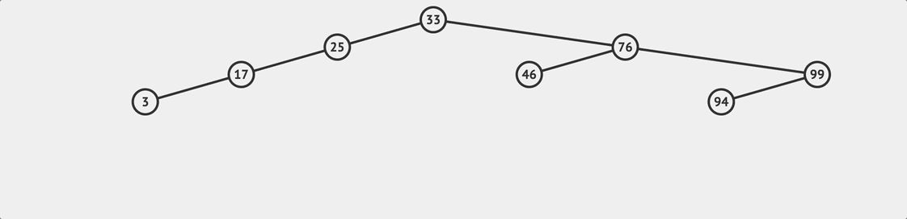
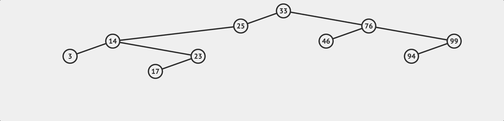
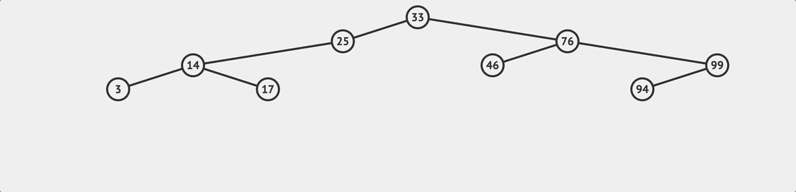

## What's a binary search tree? 
This is a note about binary search tree (BST) in JavaScript that I wrote when I was learning it.
A binary search tree is a type of binary tree that maintains a specific relationship between nodes.
It is named as such because it is particularly effective for searching operations. 

A BST must adhere to the following condition for any node:

- The value of all nodes in the left subtree is less than the value of the node.
- The value of all nodes in the right subtree is greater than the value of the node.

This condition allows for efficient searching operations, 
as the search can be narrowed down to either the left or right subtree based on the comparison of the target value with the current node's value.

In a binary tree, you can perform the following operations: 
- lookup
- insert
- delete


## Node
A node is a point in a tree, and in code, we represent a node using a specific structure. 
For example, in JavaScript, we can represent a node as follows:

```javascript
class Node {
  constructor(value) {
    this.left = null;
    this.right = null;
    this.value = value;
  }
}
```

In the example above, `left` represents the left child node, `right` represents the right child node, and `value` represents the value of the node itself.
Now, let's create a BST. We'll add a class with three methods: lookup, insert, and delete.
```javascript
class BinarySearchTree {
  constructor(){
    this.root = null;
  }
  insert(value){}
  lookup(value){}
  remove(value){}
}
```

## insert 

First, let's make the insert method, after creating a new Node, 
we need to check the edge case, which is whether the root exists.

```javascript
insert(value){
	// create a new node
	const newNode = new Node(value);
    if (this.root === null) {
      this.root = newNode;
    } else {
	    ...
    }
}
```
{/* 接著就可以開始根據 `value` 來尋找適合插入的位置，還記得 BST 的規則是什麼嗎？任何兩個節點，
左邊那個節點的值一定大於右邊節點的值。我們會從根節點遍歷往下尋找，判斷目標值 `value` 是大於或小於目標節點的值，
如果結果是大於，就往右邊繼續比較和查找；否則往左邊。執行這樣的邏輯直到找到適合插入的位置為止。 */}

Then, we can start searching for the appropriate insertion position based on the `value`. 
Remember the rule of BST? 

> For any two nodes, the value of the left node is always greater than the value of the right node. 


``` js
insert(value){
	// 新增節點
	const newNode = new Node(value);
    if (this.root === null) {
      this.root = newNode;
    } else {
      // 先把要檢查的目標 node 設為 root 
	 let currentNode = this.root;
      while(true){
        // 拿要插入的節點的值與當下節點的值作比較
        // 如果目標值小於當下節點的值，就往左邊找
        if(value < currentNode.value){
	      // 先檢查左邊的值存不存在
          if(!currentNode.left){
            // 如果不存在，表示這個位置就是目標位置
            currentNode.left = newNode;
            return this;
          }
          // 如果左邊還有值，表示可以往下尋找
          currentNode = currentNode.left;
        } else {
          // 如果目標值大於當下節點的值，就往右邊找
          // 右邊的邏輯比照上面
          if(!currentNode.right){
            currentNode.right = newNode;
            return this;
          } 
          currentNode = currentNode.right;
        }
      }
    }
}
```

## loopup 查找

要在 BST 上尋找某個值，相對來說比較簡單，只要根據 BST 的規則持續比較和遍歷就行。和插入的邏輯很像，從 root 節點往下開始與目標值做比較，來看看要往右邊去尋找還是左邊，直到目標值和某個節點的值相等為止。

要注意的是如果查找到最後發現 `currentNode` 變成 `null` ，那就表示想要查找的值並不存在這棵樹上。

``` js
...
lookup(value){
    if (!this.root) {
      return false;
    }
    let currentNode = this.root;
    while(currentNode){
      if(value < currentNode.value){
        currentNode = currentNode.left;
      } else if(value > currentNode.value){
        currentNode = currentNode.right;
      } else if (currentNode.value === value) {
        return currentNode;
      }
    }
    return null
}
...
```

## remove 刪除

最後一個方法是刪除節點 ，也是比較複雜的一個方法。刪除方法其實又可以細分為兩個步驟：

- 查找要被刪除的目標節點
- 移除這個節點

第二點要注意的是如果我們刪除的目標節點是有其他子節點的，那麼我們必須在這個節點被移除後**把剩下的子節點和原來的樹接回在一起**，就像上面流程圖展示的流程一樣。

所以在查找的過程中，除了在搜尋時我們會不斷修改 `currentNode` 用來執行下一次的數值大小判斷，我們還必須把我們**正在查找的節點的父節點 (Parent Node) 也一起記下來**；ˋ至於搜尋的流程，基本上跟前面提到的 lookup 的邏輯一樣。

```js
remove(value) {
    if (!this.root) {
      return false;
    }
    let currentNode = this.root;
    let parentNode = null;
    while (currentNode) {
	  // 和查找邏輯一樣    
      if (value < currentNode.value) {
        parentNode = currentNode;
        currentNode = currentNode.left;
      } else if (value > currentNode.value) {
        parentNode = currentNode;
        currentNode = currentNode.right;
      } else if (currentNode.value === value) {
      ...
      // 找到目標節點
      // 核心刪除邏輯
      }
    }
}
```
接下來就進入到主要的刪除邏輯，實作上可以有不同的做法，以下我會用其中一種來說明。需首先我們要考慮到以下三個情況（這邊一樣用 `currentNode` 來表示當下正在查看的節點） ：

### 1. `currentNode` 沒有右邊子節點
	這是最單純的狀況，如果 `A` 節點只有左邊節點`B`的話，那表示節點 `A` 被刪除之後只要考慮 `B` 是要被指派到它的上層節點的左節點或右節點。
	
### 2. `currentNode` 有一個沒有左子節點的右子節點
	如果 `currentNode` 有左子節點，而且有一個**沒有左子節點的右子節點**，那在 `currentNode` 被刪除之後，我們會讓右子節點接管，然後把原來 `currentNode` 的左子節點移動到右子節點的左子節點。
	
### 3. `currentNode` 有一個有左子節點的右子節點 
	如果目標節點右子節點有左子樹的話，我們就要找到在這個左子樹上的最小值（最左子節點），然後讓這個最左子節點取代原來的節點，換句話說我們要找**一個比原來節點大，但是比其右節點上數值都要小的值**。

```js

 remove(value) {
	  ...
      // } else if (currentNode.value === value) {
      ...
      // 找到目標節點
      // 核心刪除邏輯
      // 1. currentNode 沒有右邊子節點
        if (currentNode.right === null) {
          if (parentNode === null) {
            // 如果沒有 parentNode 表示是 root 
            this.root = currentNode.left;
          } else {
            
            // 比較當前節點的值和 parentNode 
            // 如果上層節點比較大，那麼就把 currentNode.left 指派成上層節點的左子節點
            if (currentNode.value < parentNode.value) {
              parentNode.left = currentNode.left;
			// 反之則指派成右子節點
            } else if (currentNode.value > parentNode.value) {
              parentNode.right = currentNode.left;
            }
          }

          // 2. currentNode 有一個沒有左子節點的右子節點
        } else if (currentNode.right.left === null) {
	      // 原來 currentNode 的左子節點在 currentNode 被刪除後將成為右子節點的左子節點，然後由這個右子節點接管 currentNode
          currentNode.right.left = currentNode.left;
          if (parentNode === null) {
            this.root = currentNode.right;
          } else {
            // 接合被刪除節點的子節點樹，與前一個情況相同
            if (currentNode.value < parentNode.value) {
              parentNode.left = currentNode.right;
            } else if (currentNode.value > parentNode.value) {
              parentNode.right = currentNode.right;
            }
          }

          // 3. currentNode 有一個有左子節點的右子節點 
        } else {
          //先找到右子樹上的最左子節點
          let leftmost = currentNode.right.left;
          let leftmostParent = currentNode.right;
          while (leftmost.left !== null) {
            leftmostParent = leftmost;
            leftmost = leftmost.left;
          }

		  // 如果最左節點有右子樹，把他指派給其上層節點
          leftmostParent.left = leftmost.right;
          // 把最左節點的左右節點接上 currentNode 的左右節點
          leftmost.left = currentNode.left;
          leftmost.right = currentNode.right;

          if (parentNode === null) {
            this.root = leftmost;
          } else {
		    // 判斷原來節點的值是比其上層節點大或小
		    // 以此決定新的節點要接上上層節點的左節點或是右節點
            if (currentNode.value < parentNode.value) {
              parentNode.left = leftmost;
            } else if (currentNode.value > parentNode.value) {
              parentNode.right = leftmost;
            }
          }
        }
      }
    }
}
```