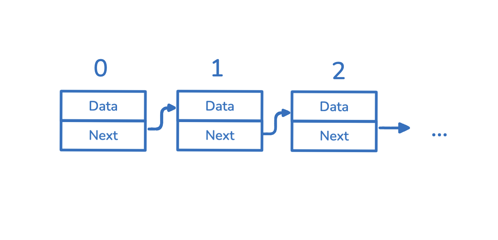
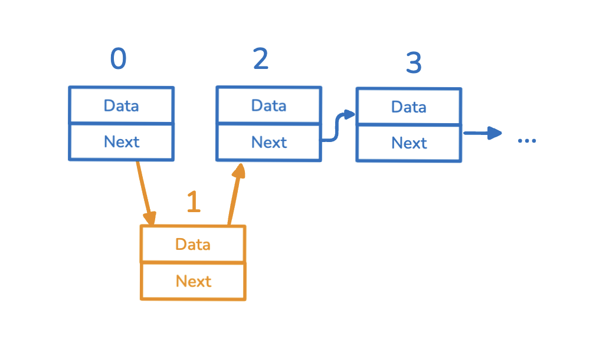

In this article, we're going to introduce how to make a linked list in JavaScript. JavaScript doesn't have a built-in class like `LinkedList`, but we can create one ourselves.
## What is a Linked List ? 
A linked list is a collection of data elements, each called a `node`. Each node contains a value `data` and a reference, `next`, that points to the location of the next node.

There are different types of linked lists:
- Singly linked list
- Doubly linked list
- Circular linked list

But in this article, we'll focus on the simplest type: **a singly linked list**.

## Linked List
Let's start creating a linked list! 

First, we need to understand what a node in a linked list looks like. As we mentioned above, a node will have a `data` attribute and a `next` attribute to "link" to the next node. 
```js
{
	data: {...}
	next: null // use to reference to another node
}
```

And we can create our `LinkedList` class. Inside this class, we'll also need a `head` member to denote the starting point of the linked list and a `tail` member to record the last node in our linked list. 

We'll create our `head` node inside the constructor of this class. Remember, when the first node, which is the head node, is created, there's no other node yet,
<Notation type="underline" color="white"> so the head node is also the tail node.  </Notation> If we want to track the length of this linked list, we can also add a `length` member. 

Another thing to keep in mind is that a linked list should include the following methods: 
- `append`
- `prepend`
- `insert`
- `remove`


```js
class LinkedList{
	head = null;
	tail = null;
	length = 0;
	
	constructor(value){
		this.header={
			value,
			next: null // there no "next" node yet
		}
		this.tail = this.head
		this.length += 1;
	}

    append(value){...}
    prepend(value){...}
    insert(index, value){...}
    remove(index){...}
}
```

Then, when we create a LinkedList, we'll have a head node as well.

```js
const myLinkedlist = new LinkedList(10);
console.log(myLinkedList);
```

If we log the code above, it will look like this: 

```js
LinkedList {
  head: { value: 10, next: null },
  tail: { value: 10, next: null },
  length: 1
}
```


## append Method

When implementing the `append` method, we need to note that we're actually adding another node to the `next` attribute of the last node, which is the `tail` member inside the `LinkedList` class.

So in the `append` method, after creating our `newNode`, we should assign it to `this.tail.next`. Keep in mind that `this.tail` is not our new node yet; we have to change it after assigning `this.tail.next`.

```js
...
append(value: number){

    const newNode: LinkListNode = {
        value,
        next: null
    }

    if(this.tail){
        // the tail is the last node
        this.tail.next = newNode;
    }

    // set our new node as the last node
    this.tail = newNode;
    // and then increase the length
    this.length += 1;
}
```

## prepend Method

The logic of the `prepend` method is very similar to that of the `append` method. In the `prepend` method, we modify the head to point to our new node. 
However, we need to set the `next` attribute of our new node to the current head before modifying the head node itself.

```js
...
prepend(value: number){

    const newNode: LinkListNode = {
        value,
        next: null
    }

    if(this.head){
        // modify newNode.next to current head before changing t
        newNode.next = this.head;
    }

    this.head = newNode;
    this.length += 1;

}
```

## insert Method

The implementation of the `insert` method is a bit more challenging compared to the previous two methods. 
This method requires two parameters: `index` and `value`, because we need to know the location and the value to complete the action.

```js
...
	insert(index, value){
		...
	} 
...
```

The `index` parameter is similar to that in an array; it represents the indices of our linked list. 
For example, the value at index `0` corresponds to the head node, and so on.



To complete an insertion, we need two steps:

- Find the correct node at the specified index.
- Replace the node we find with the new node.

To find the correct index in a linked list, we need a traverse function. 
We can use a counter and a while loop to achieve this:

```js
traverseToIndex(index){
	
	let counter = 0;
	let currentNode = this.head;
	
	while(counter !== index ){
		if(currentNode?.next){
			currentNode = currentNode?.next;
			counter++;
		}
	}
	
	return currentNode;
}
```

Before writing our main logic, we need to handle the edge cases: when the index is greater than the length of our linked list, and when the index is equal to `0`.

```js
insert(index: number, value: number) {
    if (index >= this.length) {
        return this.append(value);
    }
   
    if (index === 0) {
        this.prepend(value);
        return;
    }
    ...
}
```

Why do we need to handle `index === 0`? One thing to be careful about is that since we want to insert the node at the target index, we have to get the previous node of the node at this index (`index - 1`).



That is to say, our target node is the node at `index-1`. Then, after we find the right node, we can do two things to replace this node with our new node:

- Set the next node of our new node to the next node of our target node.
- Set the next node of our target node to our new node.

And this will be our main insert logic.

```js
  
insert(index: number, value: number) {
    if (index >= this.length) {
        return this.append(value);
    }

    if (index === 0) {
        this.prepend(value);
        return;
    }

	 const newNode: LinkListNode = {
        value,
        next: null
    }

    const targetNode = this.traverseToIndex(index - 1);
    if (targetNode) {
	    // set the next node of our new node to the next node of our target node 
        newNode.next = targetNode.next;
        // set the next node of our target node to our new node
        targetNode.next = newNode;
    }
    this.length += 1;
}
```

## remove method 
Finally, the `remove` method. The `remove` method is relatively easy if we understand how to implement the `insert` method. 
First, we also need to find the previous node of the target node that we want to remove.

Then similarly, we need to deal with the edge case of `index === 0` and index equals to `length-1`. 
And the main logic of removing a node is very simple,<Notation type="underline" color="white"> we just need set the `next` node of the node at `index-1` to the next node  of our target node. </Notation> So the code will look like this: 
 
```js
remove(index: number){
   if (index === 0 && this.head){
       this.head = this.head?.next;
       this.length -= 1;
       return;
   }
   
   const targetNode = this.traverseToIndex(index-1);
   
   if (index === this.length-1 && targetNode){
       this.tail = targetNode;
       this.tail.next = null;
       this.length -= 1;
       return;
   }

   const nodeToRemove = targetNode?.next;
   if(targetNode && nodeToRemove){
       targetNode.next = nodeToRemove.next;
   }
   this.length -= 1;
}
```

## Reference 
- https://visualgo.net/en/list?slide=1
- https://www.geeksforgeeks.org/linked-list-data-structure/
