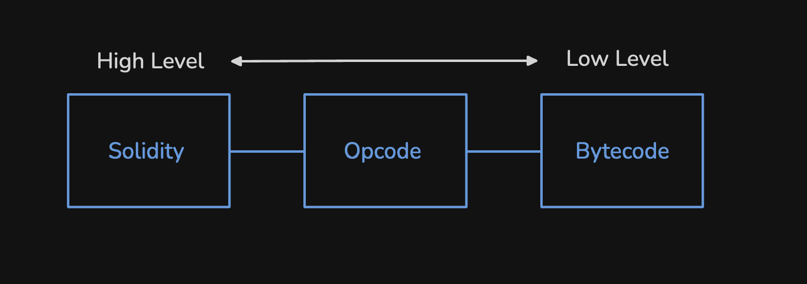
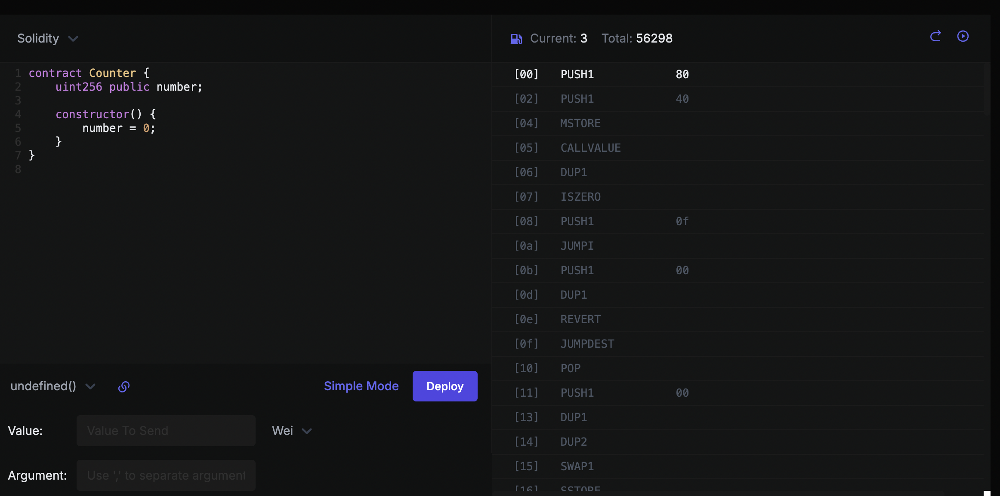

This article is intended to introduce how the Opcodes ( Operation Code ) behind Solidity actually work in the EVM. When we write a contract, although we use Solidity, a human-readable programming language, Solidity is not for machines to read. Therefore, we need the intervention of a compiler to help us convert human natural language into machine code that can communicate with machines.

## What does the Compiler do?

When we have written a contract in Solidity and are ready to send a transaction to the chain to create the contract, the content of the transaction we send will look like this:

```json
{
 "from": "0xd3ea1bfe3d1f99278c2ac7b6429e2e2ac32564e3",
 "value": "0x0",
 "input":"0x608060405234801561001057600080fd5b5061042480610020600...",
 "nonce": "0x16",
 "chainId": "0xaa36a7"
 ...
}
```

In the contract creation transaction, the value of `to` will be empty, and the EVM uses this to determine whether a transaction is a contract creation transaction. The machine code Bytecode compiled from the contract will be placed in the `input` data (calldata) of this transaction. You can take [this transaction](https://sepolia.etherscan.io/tx/0x8812615296a9f6f6fae1de7d972552cc40524d19367d5cbafefd598ff3e0b375) as a reference.

## What is Opcode?

  

Bytecode is a series of hexadecimal numbers, for example, the following contract and its corresponding Bytecode are as follows:

```solidity
contract Counter {
   uint256 public number;
   constructor() {
	  number = 0;
   }
}
```

```hex
0x608060405234801561001057600080fd5b506000808190555060b3806100266000396000f3fe6080604052348015600f57600080fd5b506004361060285760003560e01c80638381f58a14602d575b600080fd5b60336047565b604051603e91906064565b60405180910390f35b60005481565b6000819050919050565b605e81604d565b82525050565b6000602082019050607760008301846057565b9291505056fea26469706673582212202330b5c2a9b4fcbeb35a369dde8d746f76c57572fac897fed104ddef9f31da6364736f6c63430008130033
```

This string of hex numbers is used to let the EVM know what actions to perform or how to store data. So, what is Opcode? Opcode, also known as "operation code," can be understood as "instructions."

 
 
Each Opcode corresponds to a set of Bytecode, which is the machine language that the EVM actually executes. However, if these machine languages are all Bytecode, they are difficult for humans to read and understand. Therefore, different Opcodes correspond to different machine languages, making it easier for humans to communicate with machines.

You can find different Opcodes on [Evm.codes](https://www.evm.codes/). For example, the `PUSH1` Opcode corresponds to the machine code `0x60`, and its actual action is to put 1 byte of data onto the Stack. (The Stack is the storage space used by the EVM to compute data. If you don't know what a Stack is, please refer to my previous article: [An Overview of the Ethereum Virtual Machine (EVM)](https://powersandwich.com.tw/en/posts/evm-structure-overview/#evm-data-types))

## What happens when a Contract is created?

Here, I will explain what happens when the EVM receives the calldata in the contract creation transaction and how it uses the Bytecode inside to execute. To analyze the execution order of these Bytecodes, we can put the simple contract above into the [Evm Playground](https://www.evm.codes/playground) to see.



The contract creation can be roughly divided into the following parts, and I will explain the behavior of the Opcodes inside one by one. However, to avoid making the article too long, I may omit some details:

- Set Free Memory Pointer
- Non-Payable Check
- Constructor Logic
- Copy Runtime Code To Memory

### 1. Set Free Memory Pointer

This section of Opcode is in the first three lines of the figure above, and the content is:

```
  [00] PUSH1 80
  [02] PUSH1 40
  [04] MSTORE
```

In the above Opcode, the number at the beginning represents the offset position of the Bytecode, so it starts from 0 and increases, but this is not the focus here. `PUSH1 80` means pushing the byte `0x80` onto the Stack, and `PUSH1 40` does the same. What about `MSTORE`?


According to the description on evm.codes, this Opcode takes two pieces of data from the Stack as input and stores them in Memory. So, the meaning of this section of Opcode is:

> Store `0x80` at the Memory location `0x40`

The reason for doing this is that the convention in the EVM is to use `0x40` as the Free Memory Pointer, which means that the memory location `0x40` is a pointer that always points to the next available memory location, letting the EVM know where to store new data.

So, why is the initial value of the Free Memory Pointer `0x80`? This is because the EVM reserves memory space before `0x80` for specific purposes (refer to [documentation](https://docs.soliditylang.org/en/latest/internals/layout_in_memory.html)).

> Solidity reserves four 32-byte slots, with specific byte ranges (inclusive of endpoints) being used as follows:

- `0x00` - `0x3f` (64 bytes): scratch space for hashing methods
- `0x40` - `0x5f` (32 bytes): currently allocated memory size (aka. free memory pointer)
- `0x60` - `0x7f` (32 bytes): zero slot

### 2. Non-Payable Check

The next section of Opcode is used to check whether there is any ETH Value in the transaction used to create the contract, that is, whether any Ether is sent as the transaction `value`. By default, contracts cannot receive ETH when created unless you add the `payable` modifier to the Constructor.

```
[05] CALLVALUE 
[06] DUP1
[07] ISZERO
[08] PUSH1 0f 
[0a] JUMPI 
[0b] PUSH1 00 
[0d] DUP1 
[0e] REVERT
```

`CALLVALUE` takes the value from the `value` field in the transaction. This section of Opcode is used to check whether this value is `0`, and if not, it reverts.

### 3. Constructor Logic

Next, there will be a section of Opcode used to obtain the content of the constructor. If your constructor has parameters, it will first read the parameters into Memory and then execute the constructor. This section of Opcode will have different content depending on the constructor, so I will not list each step in detail.

### 4. Copy Runtime Code To Memory

```
[18] PUSH1 b3 
[1a] DUP1 
[1b] PUSH1 24 
[1d] PUSH1 00 
[1f] CODECOPY 
[20] PUSH1 00 
[22] RETURN
```

Next, the more important part is this section of Opcode used to copy the contract's runtime code. This is because in the contract creation transaction, the final return value must be the contract's runtime code, so that the contract can be successfully stored on the chain.

The action of copying code is mainly completed through the `CODECOPY` Opcode. This Opcode takes three parameters from the Stack: `destOffset`, `offset`, and `size` as input. They represent:

- `destOffset` (`0x00`): The starting position of the copied code in Memory
- `offset` (`0x24`): The starting position of the Bytecode to be copied. The starting position is not `0x00`, because the constructor logic mentioned in the previous section must be excluded and not included in the runtime Code.
- `size`: (`0xb3`) The number of bytes to copy starting from the offset

When this section of Opcode is executed, the corresponding Stack status is as shown in the figure below. Since `CODECOPY` takes the top three pieces of data from the Stack as input to perform the copy action, after executing this Opcode, the top three pieces of data on the Stack will disappear, and the contract's runtime Code will have been stored in Memory.

The last line of `RETURN` code is used to return the copied code, and then the contract's Runtime Bytecode will be stored on the chain (in Account Storage), thus completing a contract deployment.


## Reference

- https://makemake.site/post/solidity-considered-harmful
- https://ethervm.io/#34
- https://medium.com/@genisis0x/deep-dive-into-solidity-opcode-a8cc78d3cb31
- https://www.evm.codes/playground
- https://www.evm.codes/
