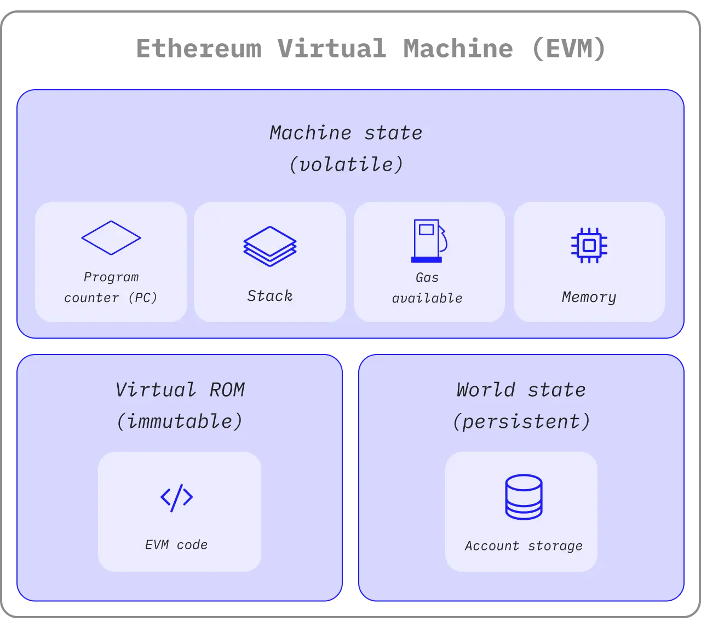
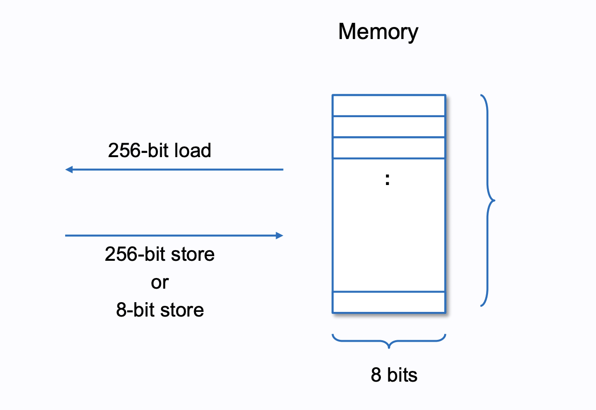
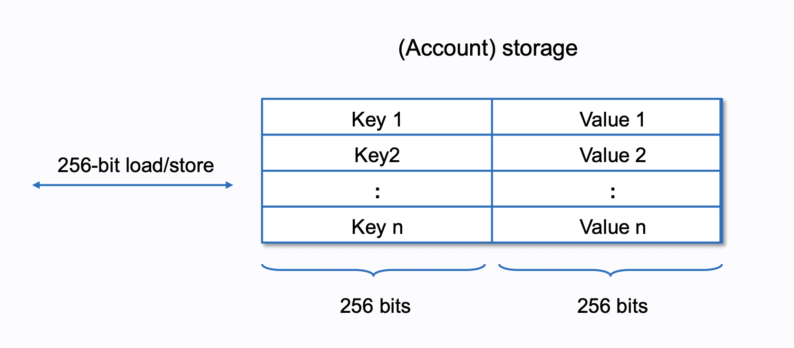
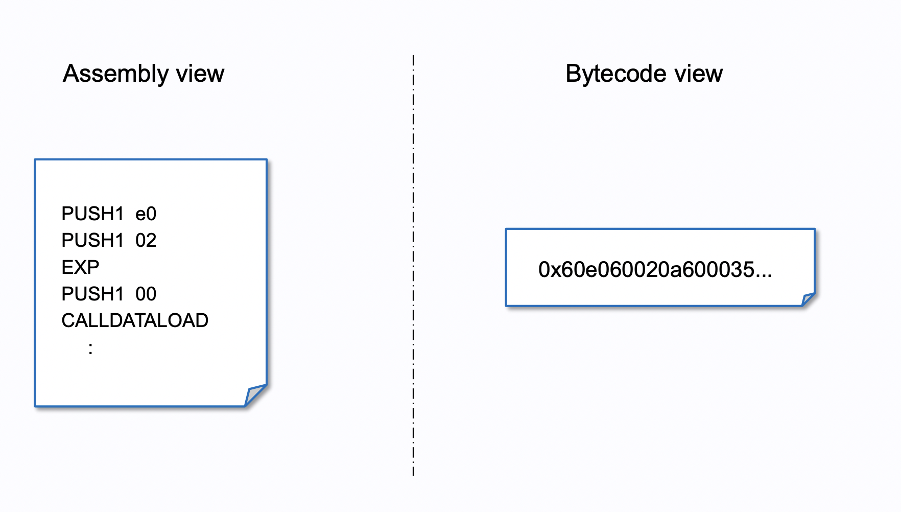

## EVM - A Large-Scale State Machine

The core part of the Ethereum blockchain system is the **Ethereum Virtual Machine (EVM)**. In the past, when explaining the principles of blockchain operation (especially Bitcoin), the analogy of a "distributed ledger" was often used. However, Ethereum not only has the characteristics of a distributed ledger but also introduces **smart contracts**, allowing code to be recorded and executed on the blockchain.

Technically speaking, <Notation type="underline" color="yellow">Ethereum is essentially a very **large state machine**, with its corresponding state referred to as the **World State**, and each transaction causes a change in state.</Notation> Anyone can execute smart contracts on the Ethereum network by submitting transactions, thereby modifying these states. The EVM is responsible for the operation of this entire process, including executing the computational logic of smart contracts, handling state updates, and managing data storage.

## Patricia Merkle Trie
Ethereum primarily uses a special tree structure called the [Patricia Merkle Trie](https://docs.alchemy.com/docs/patricia-merkle-tries#first-look-ethereum-block-architecture) (MPT) to manage data. This is a data structure that combines a regular Merkle Tree with a Patricia Radix Trie, as the data managed by Ethereum can generally be divided into two types:

- **Immutable Data**:
  - Smart contract code (Bytecode): Immutable after deployment, ensuring the contract execution logic is fixed.
  - Transaction records (Transaction Hash / Receipt): Permanently stored on chain after confirmation.
- **Mutable Persistent  Data**:
  - Account-related data, such as account balance and Nonce.
  - Storage data of smart contracts, such as token balances and variables stored within the contract.

The first type of data is well-suited for storage using the **Merkle Tree** structure, as it can effectively enhance query efficiency and ensure data integrity and verifiability. The second type of data, which may change frequently, is well-suited for storage using MPT. Since MPT has the characteristics of both Merkle Tree and Patricia Trie, it is very suitable for storing these two types of data.

## EVM Data Types

In the [Ethereum official documentation](https://ethereum.org/en/developers/docs/evm/), it is mentioned that there are several different memory types in the EVM, each responsible for different tasks:
- ### Volatile Data Type:
  - Stack
  - Calldata
  - Memory
- ### Persistent Data Type:
  - Storage (Mutable)
  - Transient Storage
  - Code Storage (Immutable)

Next, I will explain these memory types in the EVM.

## Stack

The Stack is used for executing logic and performing calculations on contracts in the EVM. The entire EVM architecture is based on this data structure. The Stack is a **Last In, First Out (LIFO)** data structure, primarily used to **store short-term data during calculations**, such as numerical operations and logical judgments. Additionally, the Stack has the following characteristics:

- The Stack has a maximum depth limit of **1024** layers.
- Only the top 16 pieces of data in the Stack can be accessed.
- Each data item has a fixed length of **256-bit**.

The Stack is the core of EVM execution, all arithmetic operations (such as addition, subtraction, multiplication, and division) are performed here.

## Calldata

Calldata is the data attached when a transaction is sent out to interact with a smart contract. It can only be read and cannot be modified.
<Notation type="underline" color="yellow">Calldata will be included as part of the transaction record on the blockchain, making it the most cost-effective way to store data. Calldata is mainly used to reduce Gas costs, as it does not require additional Gas consumption like Memory does</Notation> (Memory will be discussed below).

## Memory

Memory is used to **store temporary data during a transaction**. <Notation type="underline" color="yellow">This type of data is cleared after the transaction ends. The size of Memory is variable and can be expanded as needed.</Notation> However, Memory also consumes additional Gas as its usage increases, so minimizing the use of Memory in smart contract development is an important aspect of Gas Optimization.

Memory reads data in 32-byte (256-bit) units, while writing operations can use either 32-byte (`MSTORE`) or 1-byte (`MSTORE8`) instructions.
So, roughly speaking, you can think of Memory as a self-expanding 8-bit Array (also known as a Byte Addressed Array), although it still expands in **32-byte units**.

## Storage

Storage is responsible for storing persistent data, which is stored in Ethereum's state tree after a transaction is completed. Therefore, when <Notation type="underline" color="yellow">a transaction modifies this type of memory content, it can be said that the transaction modifies the world state of Ethereum</Notation>.

Storage reads and writes in units of at least 256 bits. The term "Account Storage" is used in the diagram because, in Ethereum, **a Contract is also a type of Account, and each Contract Account has its own Storage**. I will write another article to explain Accounts.

Writing to Storage costs significantly more Gas than using Memory, so it is crucial to be cautious when using Storage memory to avoid excessive reading or writing.

## Transient Storage
In addition to standard Storage, there is a special type of Storage called Transient Storage, proposed in [EIP1153](https://eips.ethereum.org/EIPS/eip-1153#motivation). Traditionally, when a transaction is sent to a contract and executed, it often involves transactions across different contracts (Internal Transaction), for example:
- `A Contract`  --call--> `B Contract` 
- `B Contract`  --call--> `C Contract`

In such cases, it is not easy to share some state between these contracts for calculations or checks. Using Memory is not feasible, as Memory is cleared at the end of the transaction. You can store the required data in Storage to achieve this, but it is much more expensive than using Memory.
<Notation type="underline" color="yellow">Transient Storage behaves like Storage during transaction execution but is automatically cleared when the transaction ends, making it a gas-efficient way to store temporary data without modifying Ethereum's World State.</Notation>

Its use cases include:
- Reentrancy Locks to prevent the notorious reentrancy attack
- ERC-20 authorization within a single transaction, i.e., temporary Token authorization, ensuring no excess authorization remains after the transaction, preventing future exploitation.

## Code Storage

Code Storage also stores persistent data. It is responsible for storing the machine code (Byte Code) of smart contracts after compilation. The data here cannot be changed, which is why the logic of smart contracts cannot be modified (although there are some special methods to make contract updates possible, such as the Proxy Pattern, which I will discuss in future articles).

## Reference

- [EVM Architecture](https://docs.alchemy.com/docs/patricia-merkle-tries#first-look-ethereum-block-architecture)
- [Understanding the stack-based architecture of EVM](https://faizannehal.medium.com/understanding-the-stack-based-architecture-of-evm-af45dc9819f2#:~:text=Furthermore%2C%20the%20EVM%20can%20only,%E2%80%9CStack%20too%20deep%E2%80%9D%20error)
- [Calldata](https://ethereum.org/en/developers/docs/data-availability/blockchain-data-storage-strategies/#calldata)
- [EVM Illustrated](https://takenobu-hs.github.io/downloads/ethereum_evm_illustrated.pdf)
- [EIP1153](https://eips.ethereum.org/EIPS/eip-1153#motivation)