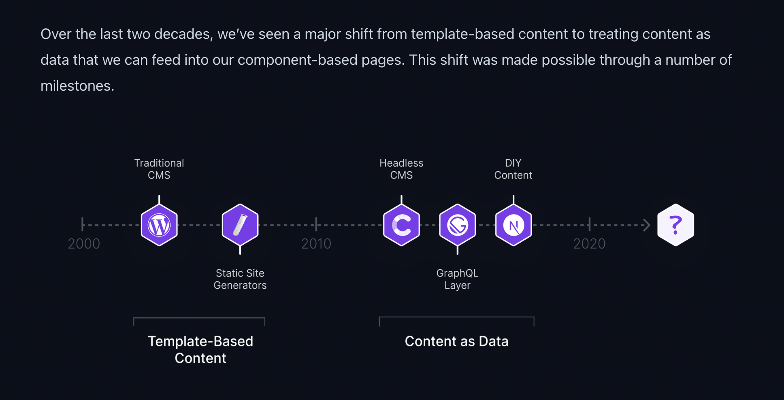
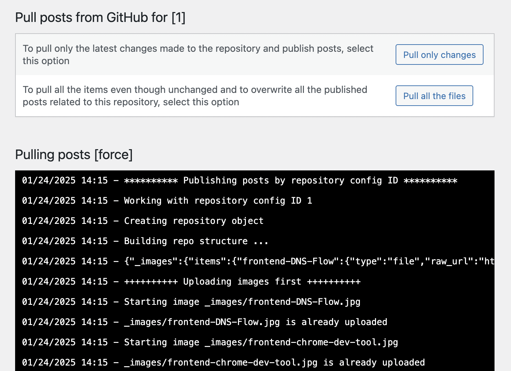
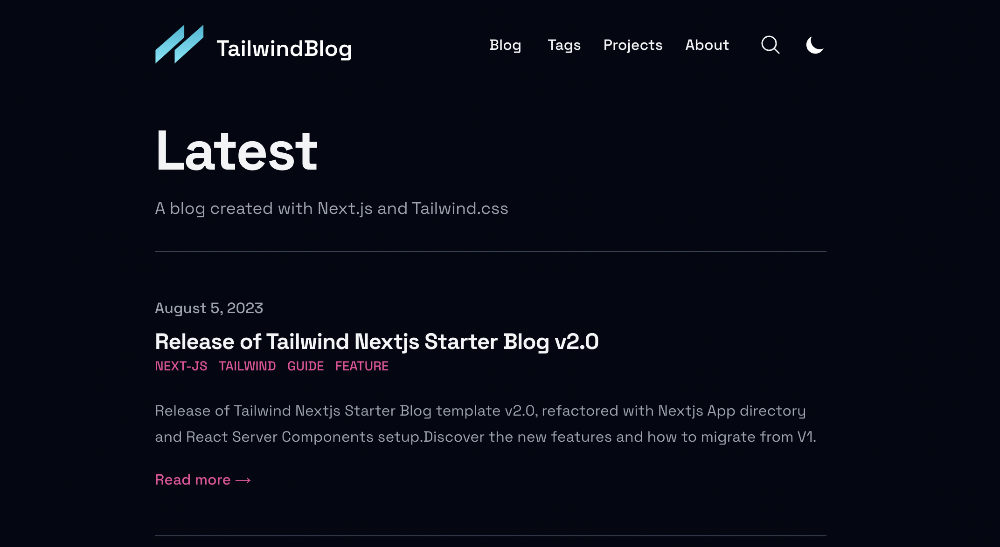
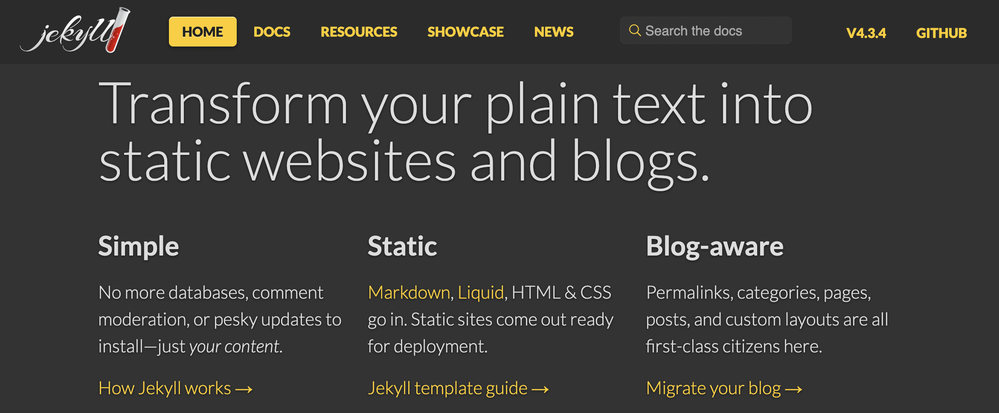
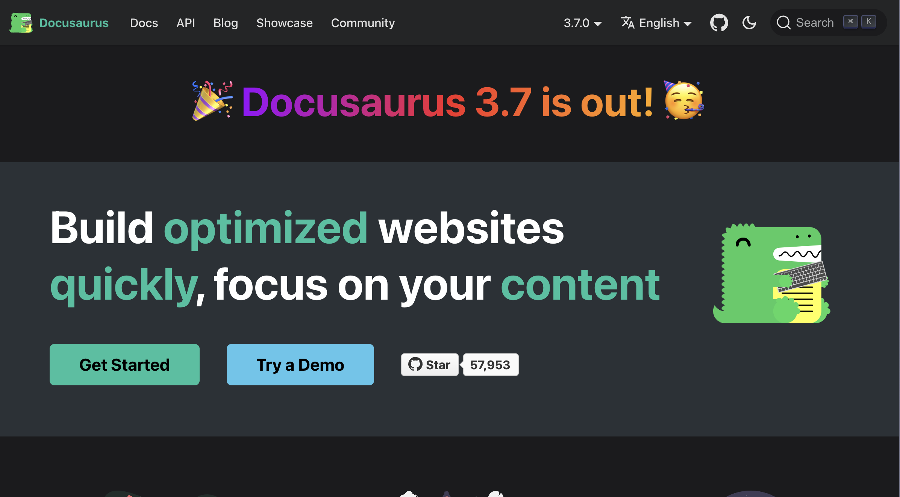
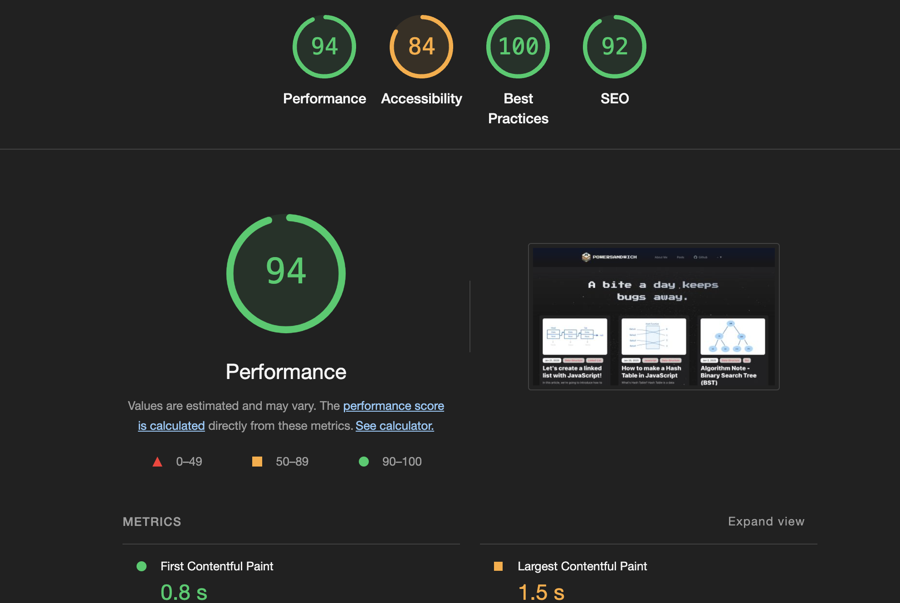

---

title: 'How I Built This Blog (and the previous ones)'
date: '2025-01-24'
description: 'I have tried many different ways to build my blog. Until recently, I discovered the Astro framework, which I had overlooked before. After using it to build my blog, I found it very friendly for modern front-end development. So I decided to start using it. This article summarizes all the mistakes I made when choosing different blog tools.'
tags: ['astro','note']
cover: "../../../assets/how-i-build-this-blog/home-page.png"
---

I have tried many different ways to build my blog. 
Until recently, I discovered the Astro framework, which I had overlooked before. After using it to build my blog,
 I found it very friendly for modern front-end development. So I decided to start using it. This article summarizes all the mistakes I made and my experience when choosing different blog tools.




I have tried many different blog tools, and I found that I have almost used all the mainstream content website frameworks. 
Although it is really time-consuming, I also found a suitable writing process for myself. This article will summarize the process of choosing different blog tools.

## What do I need as a developer to build my own blog?

I want my tool to meet the following requirements:
{/* // transform to eng */}
1.  **The content of the articles must be preserved long-term and easily transferable**: This is fundamental, as the content is the most important aspect for a writer. I want these contents to be easily transferable to other platforms or tools in the future, as no one can guarantee that there won't be better tools available. <Notation type="underline" color="yellow">Therefore, the best format is Markdown, as it is widely used in many places</Notation>.
2.  **There should be open-source, free, or low-cost templates available for me to choose from:** <Notation type="underline" color="yellow">This is to avoid spending time reinventing the wheel from scratch, as I want a tool that allows me to start writing directly</Notation>. Besides the time cost, I also want to avoid spending too much literal cost.
3.  **There should be a good SEO architecture built-in:** This is to reduce the cost of optimizing the website's SEO structure.
4.  **It should be easy to modify the front-end and develop it:** This follows the second point, as I want to <Notation type="underline" color="yellow">be able to easily modify the theme to achieve the desired functionality and appearance</Notation>.

Before using the current solution (the website you are currently seeing), I tried the following methods:

- Wordpress + Visual Page Builder [Divi](https://www.elegantthemes.com/gallery/divi/)
- Other open-source blog templates created by developers [tailwind-nextjs-starter-blog](https://github.com/timlrx/tailwind-nextjs-starter-blog)
- Other SSG: Hexo、Jekyll、Hugo

I will describe my experience with these tools one by one.

## Wordpress + Divi ( on Digital Ocean )


Wordpress is a method I once hoped to use long-term because this tool has the longest history, <Notation type="underline" color="yellow">has the largest plugin and template resources, and also has good SEO</Notation>. Although it requires renting a server and spending time researching how to start Wordpress on your own machine, there are now some third-party services that allow you to set up a Wordpress Blog without too much configuration. I previously used Digital Ocean, which provides a [simple way to set up Wordpress](https://www.digitalocean.com/community/tutorials/how-to-use-the-wordpress-one-click-install).



Besides this, another issue is that <Notation type="underline" color="yellow">it's not very convenient to preserve blog article data</Notation>. If the server is taken down and there are no other backup methods, all the article data will be lost. 
To solve this problem, I thought of a way, which is to find a plugin that can <Notation type="underline" color="yellow">sync the article data stored in a Git Repo to Wordpress</Notation>. It turns out there is one, and I ended up using a sync plugin called [Git it Write](https://wordpress.org/plugins/git-it-write/). 

This way, even if I often have to start over due to some configuration errors, I don't have to worry about moving the articles again. However, using this plugin requires following a [specific format](https://github.com/moojing/TechPosts), which took some time to organize the article data.


Next, <Notation type="underline" color="yellow">I used Divi, a no-code front-end visual tool</Notation>, to see if it would make front-end visual or layout adjustments easier. Divi offers [many themes](https://www.elegantthemes.com/layouts/), but over time, I eventually gave up on this approach because <Notation type="underline" color="yellow">the learning curve was too steep</Notation>. I often couldn't find where to set the corresponding elements on the page, or I had to Google to understand the relationships and usage of different components, which meant that effects that could be achieved by directly modifying the code often took several times longer.

The conclusion here is that the pros and cons you often hear about WordPress might all be true, so think twice before using it...

## Open-source templates



I previously used the [tailwind-nextjs-starter-blog](https://tailwind-nextjs-starter-blog.vercel.app/), <Notation type="underline" color="yellow">an open-source blog template created by someone else</Notation>. Overall, it looks very simple and the layout is quite nice. <Notation type="underline" color="yellow">It seems that the author is continuously maintaining it</Notation>, as there are now more followers and forks than when I used it before. (The [project author's blog](https://www.timlrx.com/) also uses this template, and you'll find many interesting articles there!)

This type of project is quite good, especially for developers who are accustomed to using React for development. However, there are still some minor drawbacks, such as <Notation type="underline" color="yellow">needing to spend time reading other people's code and architecture</Notation>, and if there are some features you want, you might have to implement them yourself in the early stages of the project.

Moreover, there might be more than one of these projects, but because there is no standardization, each project might look different. Unlike WordPress themes, you can't just switch them out; you have to start from scratch and modify it to the way you want. For someone like me who doesn't want to have the same design as others, this is a significant pain point, so I eventually switched away from it.

## Mainstream Static Website Generators (SSG)

There are many projects and tools of this type, and the mainstream ones include [Hexo](https://hexo.io/), [Jekyll](https://jekyllrb.com/), and [Hugo](https://gohugo.io/). These pages are hosted through [Github Pages](https://pages.github.com/), and usually these tools have corresponding Github Action settings to quickly complete the deployment, so the process is quite convenient.






Among the three tools mentioned above, I have used Hexo and Jekyll. I haven't really used Hugo, but I have tried it, and it is also very quick and convenient to use. I even tried using [Docusaurus](https://docusaurus.io), which is typically used for setting up documentation pages, to set up a blog.

Apart from Docusaurus, one great advantage of these tools is that they <Notation type="underline" color="yellow"> all offer a lot of open-source templates, allowing you to quickly install them and start writing articles</Notation>. However, they also share a common drawback: they use template languages by default for the front-end. So if you want to modify the front-end logic and are not familiar with template languages like [Pug](https://pugjs.org/api/getting-started.html) or [EJS](https://ejs.co/), you will need to spend time understanding the project structure and getting used to these template languages, or you will need to spend time adding support for JSX syntax, which is common in mainstream front-end frameworks.

## The SSG tool I'm currently using - Astro

[Astro](https://astro.build/) is the tool I'm currently using to set up my blog. At first, I was attracted to its [many customizable themes](https://astro.build/themes/), so I tried it out. 
However, after using it for a while, I decided to move all my previous articles over to it, and use it as my main tool from then on. Astro has several key features:

-  Simple syntax and high support for other frameworks
-  Excellent performance and good SEO architecture
-  A wide range of open-source themes to choose from

### Simple syntax and high support for other frameworks

Although Astro itself is also a framework, and even has its own custom syntax, its syntax is as follows:

```jsx

---
import Button from './Button.astro';
---

<div>
	<Button title="Button 1" />
</div>

```

If you have experience with React or Vue, you might find it familiar, as you are using JSX syntax, and you can even use the syntax of many [other frameworks](https://docs.astro.build/en/guides/framework-components/#using-framework-components) to implement your own components. 
Although I have never used Astro, these two features have greatly reduced my learning curve.

### A wide range of open-source themes/templates to choose from

This is a no-brainer, selecting a theme or even finding a theme you really like is something many people who want to set up their own blog would be happy about.
 Of course, if you can adjust it yourself to your liking, that's even better!

Astro has a large open-source community and many templates available for free, and if you want to use a more sophisticated template, you can choose to purchase a paid version created by others. 
You can find them on [this website](https://astro.build/themes/). 
Currently, I have also created a template for this website and uploaded it to the same website, so [if you want to try Astro, you are welcome to use my template.](https://astro.build/themes/details/astro-theme-leo/)

### Excellent performance and good SEO architecture



This is the Lighthouse score for this website, I think it's <Notation type="underline" color="yellow">still pretty good</Notation>. 
Although optimization is endless, like the screenshot above, Accessibility and LCP still have room for improvement; however, as I mentioned earlier, I don't want to spend too much time adjusting all the details, so as long as the tool has decent SEO and performance, I don't want to get too caught up in perfection.


## How did I set up this blog?
This website is not built from scratch, after all, I have always been in favor of the idea of "not reinventing the wheel"; 
Earlier, I mentioned that Astro has many open-source themes to choose from, which is one of the main reasons I started using it. <Notation type="underline" color="yellow">However, I still wanted to have a style that I created myself</Notation>, so even though I found a theme that I really liked, I decided to use it as a base and gradually modify it to the way I wanted.

This theme is [Mia](https://astro.build/themes/details/mia/), and this theme's structure is not complicated, but the style is simple and clean, and the text reading experience is also very comfortable, so I chose him. I changed the overall atmosphere to the opposite dark color system, and then used Three.js to add the starry sky animation in the background, to enhance the space feeling. And in order not to affect the loading speed, I adjusted the Astro built-in [Client Directive](https://docs.astro.build/en/reference/directives-reference/#clientidle) to lower the loading order of the background components.

Finally, in order to pay tribute to the theme Mia, I also chose another person's name [Leo](https://astro.build/themes/details/astro-theme-leo/) as the name of this theme, which is you now seeing this theme, this is the story of this website being born!


## References

- https://gohugo.io/templates/types/
- https://hexo.io/docs/setup#package-json
- https://github.com/timlrx/tailwind-nextjs-starter-blog
- https://docusaurus.io/docs
- https://pugjs.org/api/getting-started.html
- https://ejs.co/
- https://pilcrow.vercel.app/blog/astro
- https://astro.build/themes/details/astro-theme-leo/
- https://astro.build/themes/details/mia/

