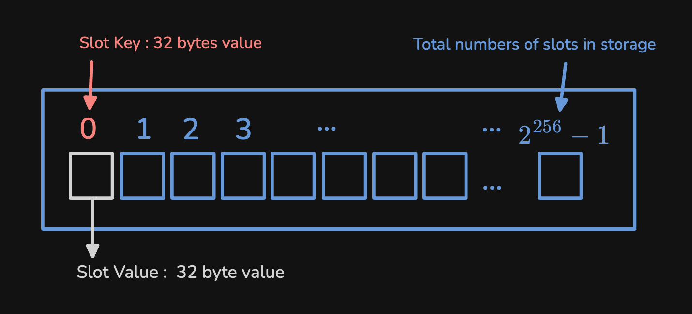
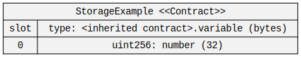
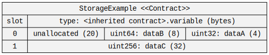
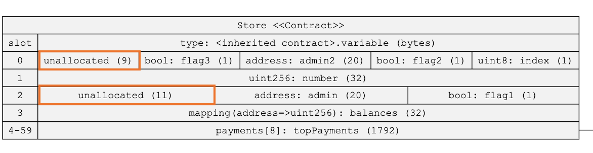
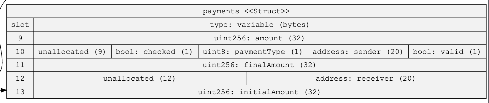

On the fourth day of participating in Encode Club, one part of our [homework](https://solidity.bootcampnotes.xyz/homework4#/) was to use the tool [sol2uml](https://github.com/naddison36/sol2uml) to observe the Storage Slot usage within [a contract](https://gist.github.com/extropyCoder/6e9b5d5497b8ead54590e72382cdca24) and try to reduce the Gas used by the contract.


```solidity
contract Store {

    struct payments {
        bool valid;
        uint256 amount;
        address sender;
        uint8 paymentType;
        uint256 finalAmount;
        address receiver;
        uint256 initialAmount;
        bool checked;
    }
    uint8 index;
    uint256 public number;
    bool flag1;
    address admin;
    mapping (address=>uint256) balances;
    bool flag2;
    address admin2;
    bool flag3;
    payments[8] topPayments;
	...

```

So in this article, we will discuss how data in contracts is stored in the EVM Storage and how to minimize Storage usage to achieve Gas optimization.

Please note that the optimizations discussed in this article only target primitive types, such as `uint`/`int`, `address`, and `bytes`. Other types like structs, which are reference types, have different allocation methods in Storage and require separate discussion.

## Outline

- EVM Storage Slots
- Why Optimize Storage Slots?
- How to Analyze Storage Slot  
- The Example In The Homework

## EVM Storage Slots


In smart contracts, each contract has its own Storage space. Storage is composed of key-value pairs, capable of storing up to 2²⁵⁶ pieces of data. In each pair, the key is used to query the corresponding data, while the value stores the actual data ( Hence the space storing the value is called a Slot ), both being 32 bytes in size.



## Why Optimize Storage Slots?
In Gas optimization, a common and important practice is to reduce the usage of Storage Slots because the cost of reading and writing to Storage Slots is high. Especially when writing to a Slot for the first time, the Gas consumption is much higher than modifying an existing Slot. Therefore, saving Slot usage can reduce the Gas needed for deployment and transaction execution.

## How to Analyze Storage Slot  
To know how to save Slot usage, we first need to understand how data is stored in Storage. We know that each Slot is 32 bytes long, or 256 bits. Additionally, we need to know that the EVM tries to maximize the use of each Storage Slot's space.

<Notation type="underline" color="yellow"> When a piece of data is placed in a Slot, if there is enough space left to store the next piece of data, the EVM will try to put both pieces of data in the same Slot. This action is called "[Slot Packing](https://noxx.substack.com/i/49905316/slot-packing)" and is done by the Compiler for you.</Notation> For example, when we store a `uint32` piece of data, it occupies 4 bytes in a Slot.

```solidity 
contract StorageExample {
	uint32 dataA;
}
```

If we use the tool [sol2uml](https://github.com/naddison36/sol2uml) to view the corresponding Storage Layout, it looks like this (  This tool was learned in the course and is very helpful for contract development ):



Next, if we declare a `uint64` variable `dataB` after this variable, you will see the Storage Layout change to this:

```solidity 
contract StorageExample {
	uint32 dataA; 
	uint64 dataB; 
}
```


### Big-endian

You will find that `dataB` is placed in the same `slot0` as `dataA`, leaving 20 bytes of remaining space. Therefore, any data declared after this that is smaller than 20 bytes will also be placed in `slot0`. You will also notice that these declared data are right-aligned, not left-aligned.

In the EVM, there is a special rule for data storage: <Notation type="underline" color="yellow">all data is right-aligned. This is like in a row of boxes, new data starts from the right. This arrangement is called "[big-endian](https://docs.alchemy.com/docs/smart-contract-storage-layout#what-is-endian-ness)" in computer science, which mainly affects the storage of data like strings (`string`) or bytes (`byte`). Although the term sounds technical, it simply describes the rule of "where to start placing data".</Notation>

However, if we directly declare a `uint256` data `dataC`, this data will be stored in `slot1` because there is not enough space in `slot0`.

```solidity
contract StorageExample {
	uint32 dataA; 
	uint64 dataB; 
	uint256 dataC; 
}
```



## The Example In The Homework

Let's go back to the contract provided in our initial homework, we can see that a `struct` type data is declared at the very beginning of the contract. However, we can skip the struct definition part for now because declaring a struct only defines the data structure and does not actually occupy Storage Slots. Let's first observe the series of variable declarations at the beginning:

```solidity
{

	struct payments {
        bool valid;
        uint256 amount;
        address sender;
        uint8 paymentType;
        uint256 finalAmount;
        address receiver;
        uint256 initialAmount;
        bool checked;
    }
		
	uint8 index;
    uint256 public number;
    bool flag1;
    address admin;
    mapping (address=>uint256) balances;
    bool flag2;
    address admin2;
    bool flag3;
    payments[8] topPayments;
	...
}
```
The Storage Slot layout for the above type declarations looks like this:



We can see that `slot0` and `slot2` each have some unallocated space, but it seems we cannot reduce Slot usage by placing data in other Slots. Next, we see the declaration of the Struct Array `payments[8] topPayments`.

As mentioned earlier, reference types have different storage methods in Storage, and they are stored in separate spaces. However, here we focus on how data is allocated to Slots. Basically, the data within each Struct is allocated to Slots in the order of declaration. So if we look at the Storage Layout of `payment`, it looks like this:


It is clear that there are two Slots that only use 1 byte each, so we only need to change the order of variable declarations to change the allocation position of these two `bool` values. The final result looks like this:

``` solidity
	struct payments {
        uint256 amount;
        bool valid;
        address sender;
        uint8 paymentType;
        bool checked;
        uint256 finalAmount;
        address receiver;
        uint256 initialAmount;
    }
```


## Reference
- https://noxx.substack.com/p/evm-deep-dives-the-path-to-shadowy
- https://www.rareskills.io/post/evm-solidity-storage-layout
- https://eips.ethereum.org/EIPS/eip-2200
- https://docs.alchemy.com/docs/smart-contract-storage-layout
