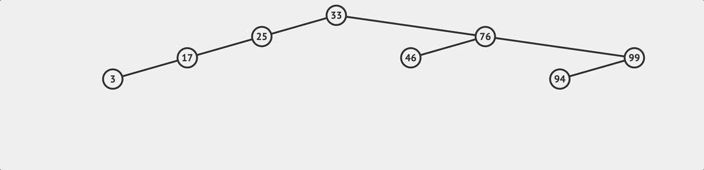
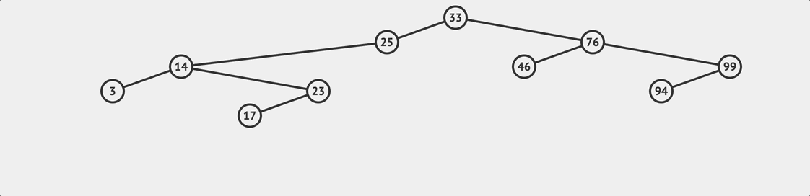
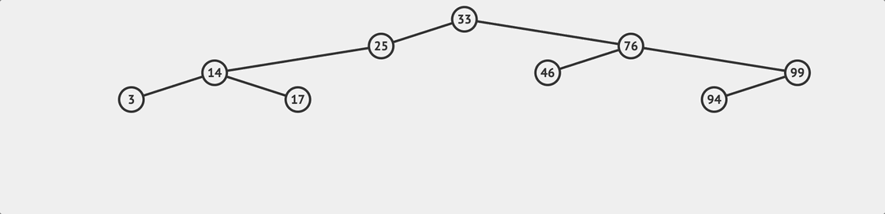

## What's a binary search tree? 

二元搜尋樹是一種保留某種關係的二元樹，就如同名字講的，他很適合用來搜尋。一個 BST 必須符合這個條件，對於一個節點而言：

- 左子樹中所有節點的值小於該節點的值。
- 右子樹中所有節點的值大於該節點的值。

可以簡單理解為：**任何兩個節點，左邊那個節點的值一定大於右邊節點的值**。也因為這個條件，在 BST上搜尋數值會比在單純的陣列裡面逐個元素尋找還要迅速。在一個二元樹上，可以執行一些操作：
- 搜尋  (lookup)
- 新增  (insert)
- 刪除  (delete)


## 節點 
「節點」（Node）就是樹裡面的每一個點，在程式裡面我們會用特定的結構來表示節點的值，以 JavaScript 為例的話就是：

```javascript
class Node {
  constructor(value) {
    this.left = null;
    this.right = null;
    this.value = value;
  }
}
```

其中 `left` 表示左邊的子節點，而 right 代表右邊的子節點，value 則是節點本身的值。
現在讓我們來試著創造一個 BST ，我們會新增一個 class 上面有 lookup 、insert 、delete 三種方法，接著我們會個別實作它們。
```javascript
class BinarySearchTree {
  constructor(){
    this.root = null;
  }
  insert(value){}
  lookup(value){}
  remove(value){}
}
```

## insert 新增

insert 方法，在創造新的 Node 之後，要注意的是一開始要先檢查 edge case ，也就是 root 本身存不存在。

```javascript
insert(value){
	// 新增節點
	const newNode = new Node(value);
    if (this.root === null) {
      this.root = newNode;
    } else {
	    ...
    }
}
```
接著就可以開始根據 `value` 來尋找適合插入的位置，還記得 BST 的規則是什麼嗎？任何兩個節點，左邊那個節點的值一定大於右邊節點的值。我們會從根節點遍歷往下尋找，判斷目標值 `value` 是大於或小於目標節點的值，如果結果是大於，就往右邊繼續比較和查找；否則往左邊。執行這樣的邏輯直到找到適合插入的位置為止。

``` js
insert(value){
	// 新增節點
	const newNode = new Node(value);
    if (this.root === null) {
      this.root = newNode;
    } else {
      // 先把要檢查的目標 node 設為 root 
	 let currentNode = this.root;
      while(true){
        // 拿要插入的節點的值與當下節點的值作比較
        // 如果目標值小於當下節點的值，就往左邊找
        if(value < currentNode.value){
	      // 先檢查左邊的值存不存在
          if(!currentNode.left){
            // 如果不存在，表示這個位置就是目標位置
            currentNode.left = newNode;
            return this;
          }
          // 如果左邊還有值，表示可以往下尋找
          currentNode = currentNode.left;
        } else {
          // 如果目標值大於當下節點的值，就往右邊找
          // 右邊的邏輯比照上面
          if(!currentNode.right){
            currentNode.right = newNode;
            return this;
          } 
          currentNode = currentNode.right;
        }
      }
    }
}
```

## loopup 查找

要在 BST 上尋找某個值，相對來說比較簡單，只要根據 BST 的規則持續比較和遍歷就行。和插入的邏輯很像，從 root 節點往下開始與目標值做比較，來看看要往右邊去尋找還是左邊，直到目標值和某個節點的值相等為止。

要注意的是如果查找到最後發現 `currentNode` 變成 `null` ，那就表示想要查找的值並不存在這棵樹上。

``` js
...
lookup(value){
    if (!this.root) {
      return false;
    }
    let currentNode = this.root;
    while(currentNode){
      if(value < currentNode.value){
        currentNode = currentNode.left;
      } else if(value > currentNode.value){
        currentNode = currentNode.right;
      } else if (currentNode.value === value) {
        return currentNode;
      }
    }
    return null
}
...
```

## remove 刪除

最後一個方法是刪除節點 ，也是比較複雜的一個方法。刪除方法其實又可以細分為兩個步驟：

- 查找要被刪除的目標節點
- 移除這個節點

第二點要注意的是如果我們刪除的目標節點是有其他子節點的，那麼我們必須在這個節點被移除後**把剩下的子節點和原來的樹接回在一起**，就像上面流程圖展示的流程一樣。

所以在查找的過程中，除了在搜尋時我們會不斷修改 `currentNode` 用來執行下一次的數值大小判斷，我們還必須把我們**正在查找的節點的父節點 (Parent Node) 也一起記下來**；ˋ至於搜尋的流程，基本上跟前面提到的 lookup 的邏輯一樣。

```js
remove(value) {
    if (!this.root) {
      return false;
    }
    let currentNode = this.root;
    let parentNode = null;
    while (currentNode) {
	  // 和查找邏輯一樣    
      if (value < currentNode.value) {
        parentNode = currentNode;
        currentNode = currentNode.left;
      } else if (value > currentNode.value) {
        parentNode = currentNode;
        currentNode = currentNode.right;
      } else if (currentNode.value === value) {
      ...
      // 找到目標節點
      // 核心刪除邏輯
      }
    }
}
```
接下來就進入到主要的刪除邏輯，實作上可以有不同的做法，以下我會用其中一種來說明。需首先我們要考慮到以下三個情況（這邊一樣用 `currentNode` 來表示當下正在查看的節點） ：

### 1. `currentNode` 沒有右邊子節點
	這是最單純的狀況，如果 `A` 節點只有左邊節點`B`的話，那表示節點 `A` 被刪除之後只要考慮 `B` 是要被指派到它的上層節點的左節點或右節點。
	
### 2. `currentNode` 有一個沒有左子節點的右子節點
	如果 `currentNode` 有左子節點，而且有一個**沒有左子節點的右子節點**，那在 `currentNode` 被刪除之後，我們會讓右子節點接管，然後把原來 `currentNode` 的左子節點移動到右子節點的左子節點。
	
### 3. `currentNode` 有一個有左子節點的右子節點 
	如果目標節點右子節點有左子樹的話，我們就要找到在這個左子樹上的最小值（最左子節點），然後讓這個最左子節點取代原來的節點，換句話說我們要找**一個比原來節點大，但是比其右節點上數值都要小的值**。

```js

 remove(value) {
	  ...
      // } else if (currentNode.value === value) {
      ...
      // 找到目標節點
      // 核心刪除邏輯
      // 1. currentNode 沒有右邊子節點
        if (currentNode.right === null) {
          if (parentNode === null) {
            // 如果沒有 parentNode 表示是 root 
            this.root = currentNode.left;
          } else {
            
            // 比較當前節點的值和 parentNode 
            // 如果上層節點比較大，那麼就把 currentNode.left 指派成上層節點的左子節點
            if (currentNode.value < parentNode.value) {
              parentNode.left = currentNode.left;
			// 反之則指派成右子節點
            } else if (currentNode.value > parentNode.value) {
              parentNode.right = currentNode.left;
            }
          }

          // 2. currentNode 有一個沒有左子節點的右子節點
        } else if (currentNode.right.left === null) {
	      // 原來 currentNode 的左子節點在 currentNode 被刪除後將成為右子節點的左子節點，然後由這個右子節點接管 currentNode
          currentNode.right.left = currentNode.left;
          if (parentNode === null) {
            this.root = currentNode.right;
          } else {
            // 接合被刪除節點的子節點樹，與前一個情況相同
            if (currentNode.value < parentNode.value) {
              parentNode.left = currentNode.right;
            } else if (currentNode.value > parentNode.value) {
              parentNode.right = currentNode.right;
            }
          }

          // 3. currentNode 有一個有左子節點的右子節點 
        } else {
          //先找到右子樹上的最左子節點
          let leftmost = currentNode.right.left;
          let leftmostParent = currentNode.right;
          while (leftmost.left !== null) {
            leftmostParent = leftmost;
            leftmost = leftmost.left;
          }

		  // 如果最左節點有右子樹，把他指派給其上層節點
          leftmostParent.left = leftmost.right;
          // 把最左節點的左右節點接上 currentNode 的左右節點
          leftmost.left = currentNode.left;
          leftmost.right = currentNode.right;

          if (parentNode === null) {
            this.root = leftmost;
          } else {
		    // 判斷原來節點的值是比其上層節點大或小
		    // 以此決定新的節點要接上上層節點的左節點或是右節點
            if (currentNode.value < parentNode.value) {
              parentNode.left = leftmost;
            } else if (currentNode.value > parentNode.value) {
              parentNode.right = leftmost;
            }
          }
        }
      }
    }
}
```