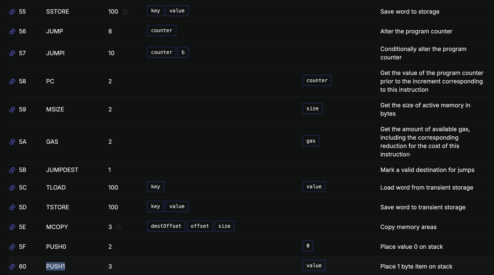

這篇文章是為了介紹 Solidity 背後的操作碼 (Operaion Code 或 OP Code) 實際上在 EVM 裡面是怎麼運作的。我們在寫一份合約的時候雖然是使用 Solidity 這個人類看得懂的程式語言，不過 Solidity 可不是給機器看的，所以我們需要 Compiler 的介入來幫助我們把人類的自然語言轉換成能與機器溝通的機器碼。

## Compiler 做了什麼？

當我們用 Solidity 寫好了一份合約，準備發出交易送到鏈上創造合約的時候，我們送出的交易內容會長這樣：

```json
{
 "from": "0xd3ea1bfe3d1f99278c2ac7b6429e2e2ac32564e3",
 "value": "0x0",
 "input":"0x608060405234801561001057600080fd5b5061042480610020600...",
 "nonce": "0x16",
 "chainId": "0xaa36a7"
 ...
}
```

創建合約的交易中， `to` 的值會是空的，EVM 也是以此來判斷一筆交易是不是創造合約的交易，而合約被編譯後的機器碼 Bytecode 會跟著被放到這筆交易的 `input` data (calldata)內，你可以用[這筆交易](https://sepolia.etherscan.io/tx/0x8812615296a9f6f6fae1de7d972552cc40524d19367d5cbafefd598ff3e0b375)作為參考。

## Opcode 是什麼？

  

Bytecode 是一連串的 16 進制 ( Hexadecimal ) 數字，例如以下這份合約和所對應的 Bytecode 如下：

```solidity
contract Counter {
   uint256 public number;
   constructor() {
	  number = 0;
   }
}
```

```hex
0x608060405234801561001057600080fd5b506000808190555060b3806100266000396000f3fe6080604052348015600f57600080fd5b506004361060285760003560e01c80638381f58a14602d575b600080fd5b60336047565b604051603e91906064565b60405180910390f35b60005481565b6000819050919050565b605e81604d565b82525050565b6000602082019050607760008301846057565b9291505056fea26469706673582212202330b5c2a9b4fcbeb35a369dde8d746f76c57572fac897fed104ddef9f31da6364736f6c63430008130033
```

而這一串 Hex 數字就是用來讓 EVM 知道該執行什麼動作，或是要把資料用什麼方式儲存在哪裡。說到這裡，那麼 Opcode 又是什麼呢，Opcode 又稱「操作碼」，可以理解為「指令」。

 
 
因為每個 Opcode 都對應著一組 Bytecode ，而這組 Bytecode 是 EVM 實際執行的機器語言，但是如果這些機械語言都是 Bytecode ，對人類來說是難以閱讀及理解的，所以才有不同的 Opcode 來對應不同的機器語言，讓人類更方便能夠與機器溝通。

你可以在 [Evm.codes](https://www.evm.codes/) 查詢到不同的 Opcode。 舉例來說：`PUSH1` 這個 Opcode ，它對應的機器碼是 `0x60` ，而他所實際執行的動作是把 1 byte 的資料放到 Stack 上。（ Stack 是 EVM 用來運算資料的儲存空間，如果不知道 Stack 是什麼的話，請參考我之前寫的文章：
[An Overview of the Ethereum Virtual Machine (EVM)](https://powersandwich.com.tw/en/posts/evm-structure-overview/#evm-data-types) ）

## Contract 被創造時究竟發生了什麼事情？

這邊會接著說明當 EVM 收到合約創造交易裡面的 calldata 之後，會怎麼用裡面的 Bytecode 來執行。要分析這些 Bytecode 的執行順序，我們可以把上面那份簡單的合約放到 [Evm Playground](https://www.evm.codes/playground) 來看看。


合約創造大致上可分為以下幾個部分，我會一個一個解釋裡面的 Opcode 做的行為，不過為了不讓文章篇幅過長，我也許會省略一些細節：

- 設定 Free Memory Pointer
- Non Payable Check
- Constructor 邏輯
- Copy Runtime Code To Memory

### 1. 設定 Free Memory Pointer

這段 Opcode 就在上圖的前三行，內容是：

```
  [00] PUSH1 80
  [02] PUSH1 40
  [04] MSTORE
```

上述 Opcode 裡面，最前面的數字代表 Bytecode 的偏移位置，所以它是從 0 開始增加的，但這不是這裡的重點。 `PUSH1 80` 表示把 0x80 這個 Byte 推到 Stack 裡面，`PUSH1 40` 也是一樣的行為，而 `MSTORE` 呢？


根據 evm.codes 的描述，這個 Opcode 會從 Stack 取出兩筆資料作為 Input，並且存到 Memory 裡面。所以這段 Opcode 的意思是：

> 把 `0x80` 儲存在 `0x40` 這個 Memory 的位置


而為什麼要怎麼做是因為在 EVM 裡的慣例是會把 `0x40` 作為 Free Memory Pointer，
<Notation type="underline" color="yellow"> 也就是說，`0x40` 這個記憶體位置是一個 Pointer，他永遠指向下一個可用的記憶體位置，讓 EVM 知道新的資料要儲存到哪裡。 </Notation>

那麼，為什麼一開始 Free Memory Pointer 的值就是 `0x80` ? 這是因為 EVM 保留了在 `0x80` 之前的記憶體空間，用來做特定的事情 ( 參考[文件](https://docs.soliditylang.org/en/latest/internals/layout_in_memory.html)）。


> Solidity reserves four 32-byte slots, with specific byte ranges (inclusive of endpoints) being used as follows:

- `0x00` - `0x3f` (64 bytes): scratch space for hashing methods
- `0x40` - `0x5f` (32 bytes): currently allocated memory size (aka. free memory pointer)
- `0x60` - `0x7f` (32 bytes): zero slot


### 2. Non Payable Check
接下來的一段 Opcde 是用來確認這個用來創造合約的交易有沒有 ETH Value ，也就是有沒有任何 Ether 作為交易的 `value` 一起被送出。創造合約時預設是不能接收 ETH 的，除非你在 Constructor 上加上 `payable` modifier。

```
[05] CALLVALUE 
[06] DUP1
[07] ISZERO
[08] PUSH1 0f 
[0a] JUMPI 
[0b] PUSH1 00 
[0d] DUP1 
[0e] REVERT
```

`CALLVALUE`  會從交易裡面的 `value` 欄位取出值，這段 Opcode 則是用來檢查這個值是不是為 `0` ， 如果不是的話就 revert 。

### 3. Constructor 邏輯
接下來會有一段 Opcode 用來取得 constructor 的內容，如果你的 constructor 有參數的話那麼就會先把參數讀取到 Memory 之後再執行 constructor 。這段 Opcode 會根據 constructor 的不一樣而有不同的內容 ，所以就先不詳細列出每個步驟。
### 4. Copy Runtime Code To Memory

```
[18] PUSH1 b3 
[1a] DUP1 
[1b] PUSH1 24 
[1d] PUSH1 00 
[1f] CODECOPY 
[20] PUSH1 00 
[22] RETURN
```

接下來比較重要的是用來複製合約 Runtime 程式碼的這一段 Opcode。因為在<Notation type="underline" color="yellow"> 創造合約的交易裡面，最後的 return 值必須是合約的 Runtime 程式碼，這樣一來才能讓合約順利地被儲存在鏈上。 </Notation>

複製程式碼這個動作主要是透過 `CODECOPY` 這個 Opcode 來完成， 這個 Opcode 會從 Stack 拿出三個參數 `destOffset`、`offset`、 `size`   三筆資料作為 input ，他們分別代表：

- `destOffset` (`0x00`) : 複製程式碼在 Memory 的起始位置
- `offset` (`0x24`) : 要複製的 Bytecode 的起始位置，起始位置並不是 `0x00` ，<Notation type="underline" color="yellow"> 這是因為上一段提到的 constructor 的邏輯必須要被排除在外，不會被包含在 Runtime Code 內 </Notation>
- `size`: (`0xb3`) 從 offset 開始，要複製的 byte 數量

這段 Opcode 執行時，對應的 Stack 狀態如下圖，而因為 `CODECOPY` 會拿最上面三筆資料作為 Input 來執行複製的動作，所以在執行這個 Opcode 之後，Stack 的最上面三筆資料會消失，而這時合約的 Runtime Code 就已經存到記憶體裡面了。

最後一行的 `RETURN` code 就是用來 return 被複製的這段程式碼，之後這份合約的 Runtime Bytecode 就會被儲存到鏈上（ Account Storage 裡面）這樣就完成了一次合約的部署。


## Reference

- https://makemake.site/post/solidity-considered-harmful
- https://ethervm.io/#34
- https://medium.com/@genisis0x/deep-dive-into-solidity-opcode-a8cc78d3cb31
- https://www.evm.codes/playground
- https://www.evm.codes/
