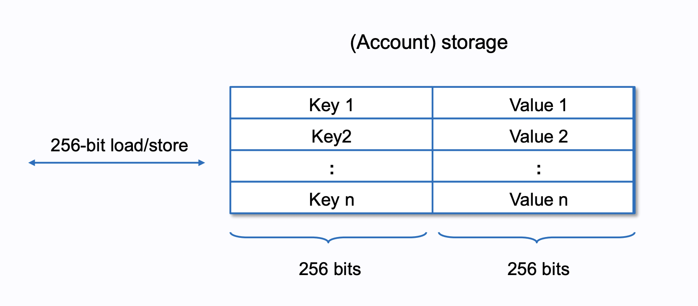
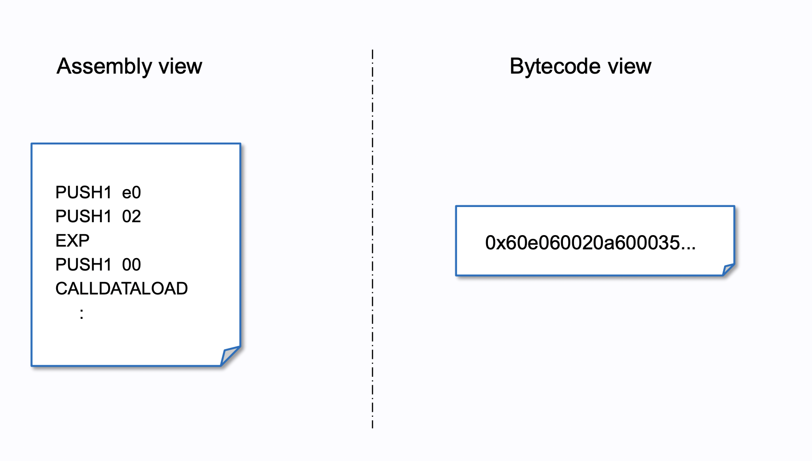

## EVM - 一個巨大的狀態機

以太坊區塊鏈系統中，最核心的部分就是 **以太坊虛擬機（EVM）**。過去在解釋區塊鏈運作原理（特別是比特幣）時，常以「分散式帳本」作為比喻。然而，以太坊不僅具備分散式帳本的特性，還引入了 **智能合約**，使程式碼也能被記錄並在區塊鏈上被執行。

因此技術上來說，<Notation type="underline" color="yellow">以太坊本質上是一個**超大規模的狀態機**，其對應的狀態被稱為 **世界狀態（World State）**，且每筆交易會導致狀態的改變。</Notation>所有人都可透過送出交易來執行以太坊網路上的智能合約，進而修改這些狀態。而其中，EVM 負責這整件事情的運作，包含：執行智能合約的運算邏輯、處理狀態更新，以及管理資料儲存。

## Patricia Merkle Trie
以太坊最主要使用一種叫做 [Patricia Merkle Trie](https://docs.alchemy.com/docs/patricia-merkle-tries#first-look-ethereum-block-architecture) ( MPT) 的特殊的樹狀結構來管理資料，這是一種把一般的 Merkle Tree 與 Patricia Trie（基數樹）結合的數據結構，這是因為以太坊管理的資料大致可以分為兩種類型：

- **不可變的永久資料**：
	-  智能合約程式碼（Bytecode）：部署後不可更改，確保合約執行邏輯固定。
	- 交易紀錄（Transaction Hash / Receipt）: 交易確認後就永久存放在鏈上。
- **持久但可變的資料**：
	- 賬戶相關的資料，如帳戶餘額（Balance）與 Nonce。
	- 智能合約的儲存數據（Storage），如代幣餘額以及合約內儲存的變數。

第一種資料很適合使用 **Merkle Tree** 的樹狀結構來做儲存，因為它能有效提升查詢效率並確保數據的完整性與可驗證性。而第二種可能會頻繁變動的資料，則很適合使用 MPT 來做儲存。而因為 MPT 同時具有  Merkle Tree 與 Patricia Trie 的特性，所以非常適合用來儲存這兩種資料。

## EVM Data Types

在 [Ethereum 官方文件](https://ethereum.org/en/developers/docs/evm/)裡面的解說裡面有提到，EVM 裡面一共有許多不同的記憶體類型，負責著不同的工作：
- ### 暫時性資料 （Volatile Data Type） :
	- Stack
	- Calldata
	- Memory
- ### 持久性資料  （ Persistent Data Type)
	- Storage ( Mutable )
	- Transient Storage
	- Code Storage ( Immutable )

接下來，我會分別針對這些 EVM 裡面的記憶體類型作說明。

## Stack

Stack （堆疊）用於 EVM 執行合約上的邏輯並進行運算的時候。整個 EVM 架構是根基於 Stack 這種資料結構之上的。 Stack 這是一種 **後進先出（LIFO）** 的數據結構，而他主要用來**存放計算過程中的短期數據**，如數值運算、邏輯判斷等，除此之外，Stack 還具有以下特性：

- Stack 限制最大深度為 **1024** 層。
- 只有 Stack 最上面的 16 筆資料可以被存取
- 每組數據長度固定為 **256-bit**。

由於 Stack 是 EVM 執行計算的核心，所有的算術運算（如加、減、乘、除）都在這裡執行。

## Calldata

Calldata 是交易被送出去與智能合約互動時附帶的數據，它只能被讀取，無法被修改。
<Notation type="underline" color="yellow"> 並且 Calldata 會作為交易的一部分存儲在區塊鏈的交易紀錄中，所以這也是存儲數據成本最低的一種方式。Calldata 主要用來降低 Gas 成本，因為它不像 Memory 需要額外的 Gas 消耗</Notation>（ 下面會提到 Memory )。

## Memory

Memory 用來**存放交易期間的臨時數據**。 <Notation type="underline" color="yellow">這個類型的資料在交易結束之後就會被清除。而且 Memory 的大小是可變動的，可以按需求擴展。 </Notation>但是相對的， Memory 也會隨著使用量增加而消耗額外的 Gas，因此在智能合約開發時，盡量減少合約上 Memory 的使用也是 Gas Optimization 重要的一環。

Memory 在讀取資料時是以最小 32 Byte ( 256 bits ) 為單位，但在寫入時最小可以以 1 Byte ( 8 bits ) 為單位，而且當寫入位置不夠時，Memory 便會以 32 Byte 為單位進行擴張。所以粗略一點的說，你可以把 Memory 想成一個自動擴張的 8 bits Array ( 又稱 Byte Addressed Array)，只是它擴展時仍以 **32 bytes 為最小單位**。

## Storage

Storage 負責存放持久性的資料，這些資料在一筆交易完成後會被存儲在 Ethereum 的狀態樹中，所以當<Notation type="underline" color="yellow">一筆交易修改了這類型的記憶體內容時，也可以說這筆交易修改了以太坊的世界狀態</Notation>。

Storage 的讀取和寫入都是以 256 bits 為最小單位。上圖使用 Account Storage 一詞，因為在以太坊裡面，**Contract 也是一種 Account，而每個 Contract Account 都有一個屬於自己的 Storage**；關於 Account ，我會再寫另一篇文章來做說明。

寫入 Storage 所花費的 Gas 遠比使用 Memory 來得高很多，所以使用 Storage 記憶體時必須非常注意，不要過度頻繁地讀取或寫入。
## Transient Storage
另外除了標準的 Storage，還有一種特殊的 Storage 叫做 Transient Storage，他是在 [EIP1153](https://eips.ethereum.org/EIPS/eip-1153#motivation) 中被提出的一個記憶體類型。傳統上，在對合約送出一筆交易並執行時，常常會牽涉到跨越不同合約的交易（ Internal Transaction) ，例如：
- `A Contract`  --call--> `B Contract` 
- `B Contract`  --call--> `C Contract`

這時如果需要在這些合約之間共享一些狀態以用來進行一些計算或檢查，就不太容易。如果使用 Memory 是不可行的， Memory 會在交易結束時被清除。你可以把需要的資料儲存在 Storage 裡面以達成這個目的，但那會遠比使用 Memory 來的昂貴。

<Notation type="underline" color="yellow"> Transient Storage 是一種只有在交易期間存在的特殊的 Storage 類型，它在交易結束後會自動清除，不會影響世界狀態，所以它的 Gas 消耗比一般的 Storage 便宜得多。</Notation>
它的使用情境像是：
- 重入鎖（Reentrancy Locks）防止惡名昭彰的重送攻擊
- 單筆交易內的 ERC-20 授權，亦即暫時性的 Token 授權，確保交易完之後沒有多餘的授權額度，避免未來變成遭受惡意利用的漏洞。

## Code Storage

Code Storage  裡儲存的也是持久性資料。它負責儲存智能合約程式碼被編譯過後的機器碼( Byte Code )，這裡面的資料是不能被更改的，所以才有智能合約邏輯不能被修改這個說法，（但還是有一些特殊做法讓合約更新變得可行，那就是 Proxy Pattern ，未來有機會會在其他文章提到。
## Reference

- [EVM Architechture](https://docs.alchemy.com/docs/patricia-merkle-tries#first-look-ethereum-block-architecture)
- [Understanding the stack based architecture of EVM](https://faizannehal.medium.com/understanding-the-stack-based-architecture-of-evm-af45dc9819f2#:~:text=Furthermore%2C%20the%20EVM%20can%20only,%E2%80%9CStack%20too%20deep%E2%80%9D%20error)
- [Calldata](https://ethereum.org/en/developers/docs/data-availability/blockchain-data-storage-strategies/#calldata)
- [EVM Illustrated](https://takenobu-hs.github.io/downloads/ethereum_evm_illustrated.pdf)
- [EIP1153](https://eips.ethereum.org/EIPS/eip-1153#motivation)