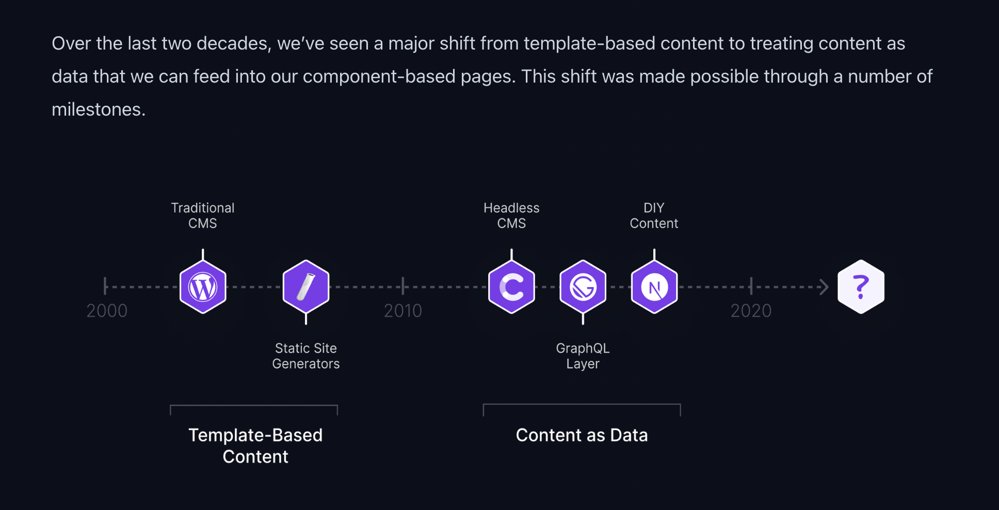
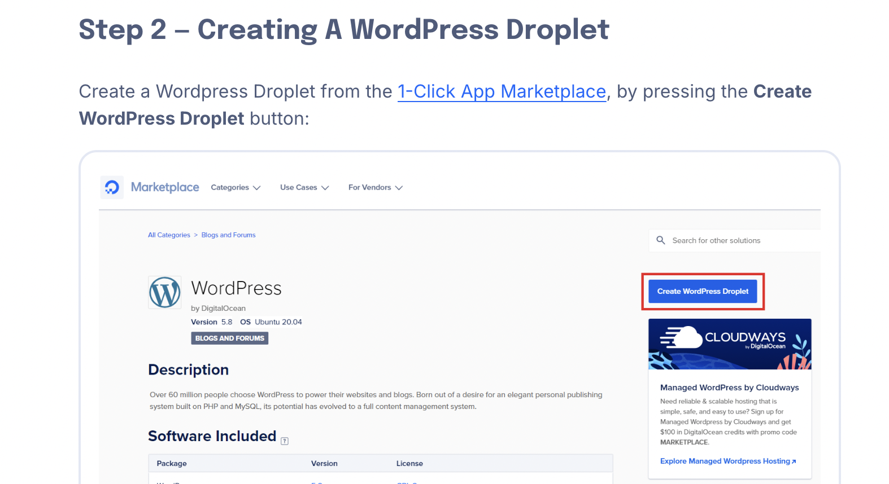
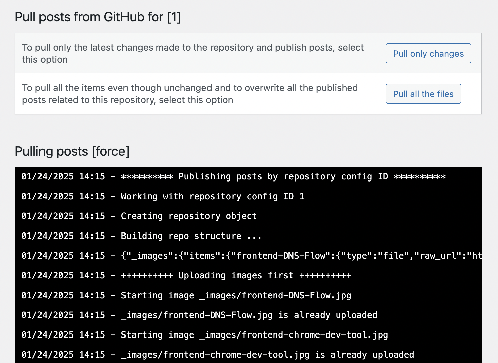
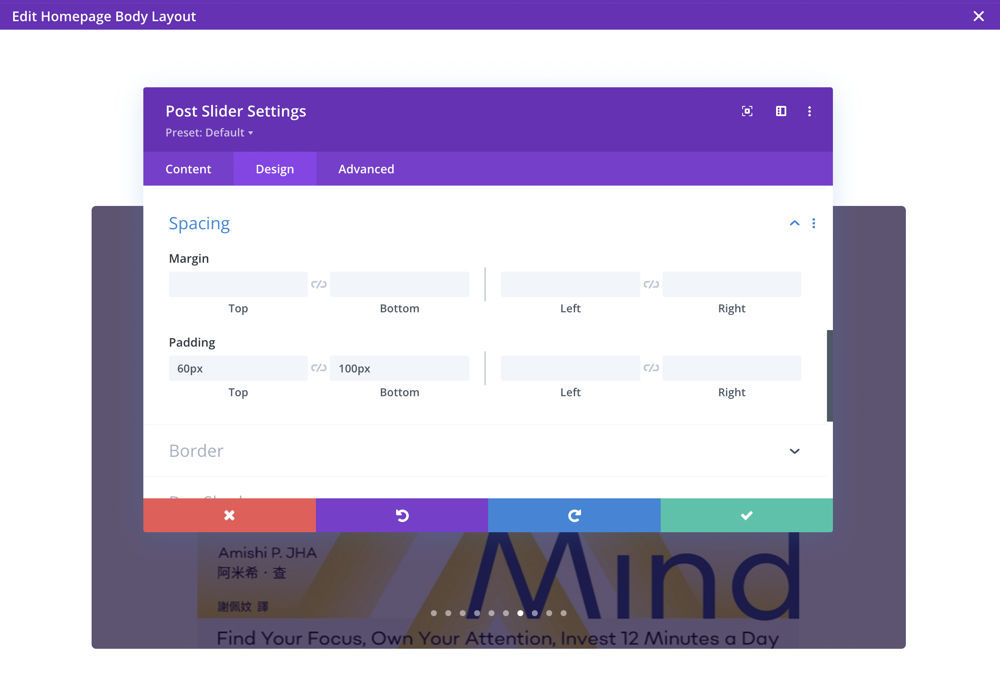
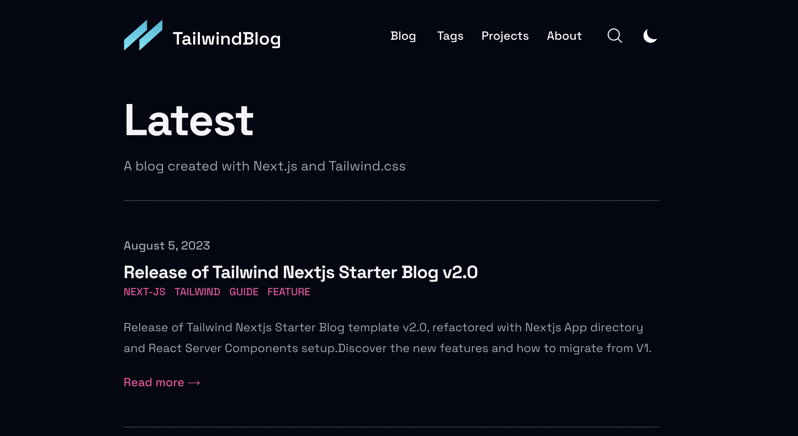
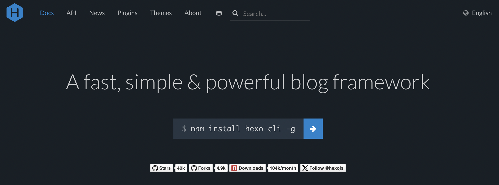
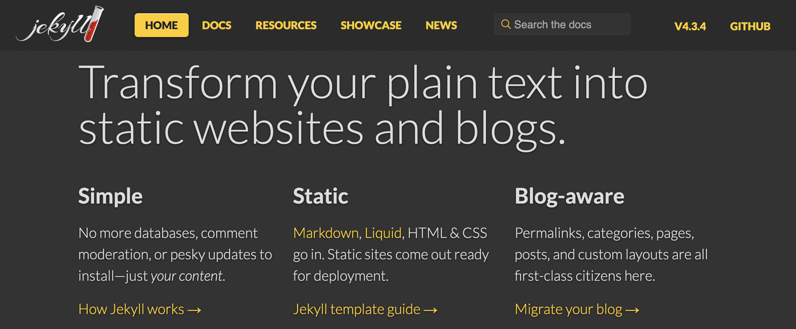
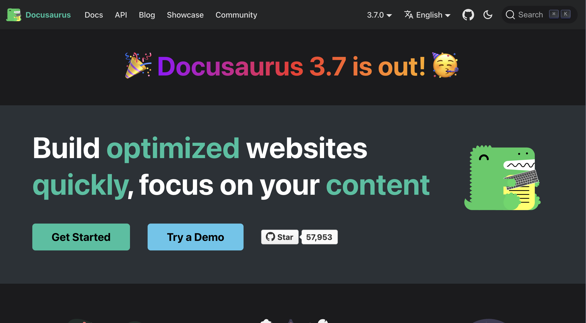
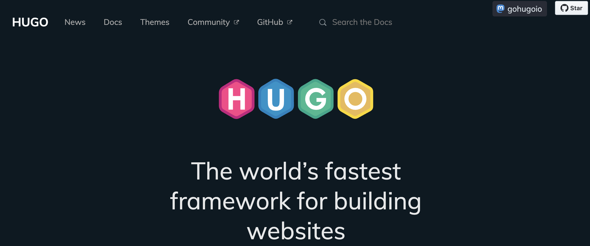
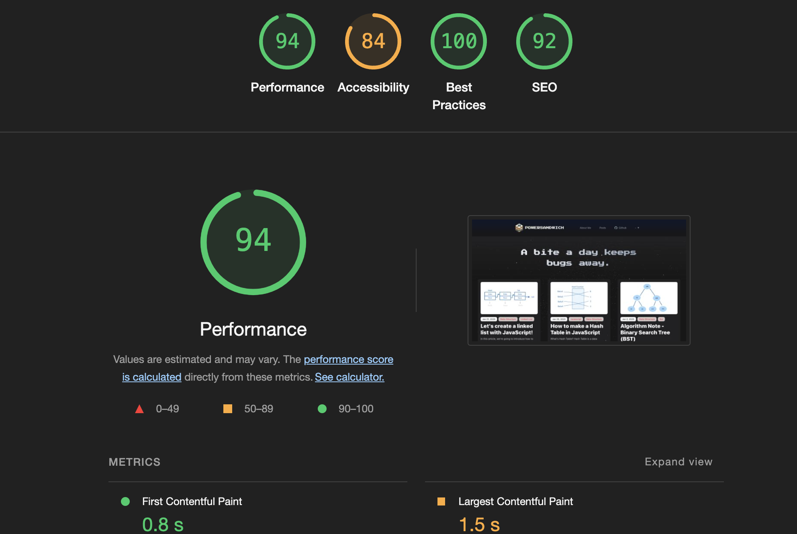

我曾經試過許多不同的方式來建立自己的部落格。直到最近我發現了我以前曾經看過但忽略的 [Astro](https://astro.build/) 這套框架，試著用它來架設部落格之後我才發現他對現在前端開發來說非常友善，不僅支援 JSX 、且除了框架內建的 astro 格式，也可以直接用自己熟悉的框架來用自己習慣的方式來製作元件，於是我就決定用 Astro 作為我接下來主要的部落格網站生成工具。



因為實在是用過太多種部落格工具，我不知不覺已經快要把各種主流的內容網站架構都使用過一次了......。雖然真的很花時間，不過最後也因此找到適合自己的寫作流程，這篇文章會用接下來的篇幅來針對之前選擇不同部落格工具的歷程來做個整理(註： [上圖出處](https://contentlayer.dev/blog/working-with-content-is-hard-for-developers))。

## 身為一個開發者想要自架部落格，我注重的需求有哪些？

我希望我使用的工具可以符合以下幾個需求：

1.  **文章內容要能夠長期保存，而且要能夠方便移轉**：這是最基本的，文章內容對一個寫作者來說是最重要的，而且我希望這些內容是方便未來轉移到其他平台或是工具的，因為誰也無法保證未來會不會有更好用的工具，<Notation type="underline" color="yellow">所以最好的格式是 Markdown，因為許多地方都通用</Notation>。
2.  **有開源、免費、或是低價的版型可以讓我選擇**：這是為了能夠<Notation type="underline" color="yellow">免去從零開始重複造輪子而花費的時間</Notation>，畢竟我想要的還是能夠讓我可以直接進行寫作的工具，而且除了時間成本，我也想盡量避免花費太多字面意義上的成本。
3.  **內建良好的 SEO 架構**: 同上，希望減少優化網站架構方面 SEO 的成本。
4.  **要能夠方便的進行前端的修改以及開發**：這點承接第二點，希望選完版型之後，我是<Notation type="underline" color="yellow">能夠輕易進行修改來改成自己想要呈現的功能及外觀的</Notation>。

如同前面提到，在使用目前的方案之前（也就是你目前看到的這個網站），我則陸續試過了以下幾種方式：

- Wordpress + 視覺化頁面建構工具 [Divi](https://www.elegantthemes.com/gallery/divi/)
- 其他開發者自架的[開源部落格模板](https://github.com/timlrx/tailwind-nextjs-starter-blog)
- 其他 SSG : Hexo 、 Jekyll、Hugo

以下會一一描述我使用這些工具的經驗。

## Wordpress + Divi ( on Digital Ocean )



Wordpress 是一個我曾經很希望能長期使用的方式，因為這個工具的歷史最悠久，<Notation type="underline" color="yellow">有最龐大的套件和模板資源，而且也有很好的 SEO</Notation>。雖然需要租一台主機而且還要花時間研究怎麼在自己的機器上啟動 Wordpress ，不過現在有一些第三方服務可以讓你不需要進行過多設定就架設好 Wordpress Blog，我之前是搭配 Digital Ocean ，這個平台有提供[簡易架設 Wordpress](https://www.digitalocean.com/community/tutorials/how-to-use-the-wordpress-one-click-install) 的方法。


除了這一點還有一個問題就是 <Notation type="underline" color="yellow">部落格文章資料保存不太方便</Notation>，因為一但架設的主機被砍掉了，如果沒有其他備份的方法的話，文章資料會全部跟著有去無回；關於這個問題我也想了一個辦法來解決，那就是找套件看有沒有辦法把<Notation type="underline" color="yellow">放在 Git Repo 裡面的文章資料同步到 Wordpress 上面</Notation> 。結果還真的有，我後來使用的同步套件叫做 [Git it Write](https://wordpress.org/plugins/git-it-write/)，如此一來就算我常常因為一些設定錯誤導致必須砍掉重練，也不用擔心文章要重新搬家，不過因為使用這個套件要符合 [特定格式](https://github.com/moojing/TechPosts)，整理這些文章資料的時候還是花了一點時間。



接著我用了 Divi 這套無程式碼 (No Code) 的前端視覺化工具 ，想試試看這樣會不會比較好進行前端視覺上或 layout 上的調整。而且 Divi 提供了[許多主題](https://www.elegantthemes.com/layouts/)，但隨著時間的推移我最終放棄使用這個方式，因為<Notation type="underline" color="yellow">學習成本實在太高了</Notation>，常常找不到頁面對應元素的設定在哪裡，或是還要 Google 研究一下才知道不同元件之間的關係和用法，導致原本直接改程式碼就能完成的效果往往要花好幾倍以上的時間。

這邊的結論就是你常常聽到關於 Wordpress 的優點和缺點，可能都是真的，要使用之前請三思 ......。

## 開源模板



我之前使用過一陣子 [tailwind-nextjs-starter-blog](https://tailwind-nextjs-starter-blog.vercel.app/) 這個別人自製的開源 Blog 模板，整體看起來非常簡潔而且排版也很好看；而且看起來<Notation type="underline" color="yellow">作者有持續在維護</Notation>，現在回去看已經比之前使用的時候多了不少追蹤和 Fork 數量。 (這個 [專案作者的 Blog](https://www.timlrx.com/) 自己也是用這個模板，翻一翻會發現裡面有許多蠻有料的文章！)

這類型的專案還算是很不錯的，尤其對於習慣用 React 做開發的開發者來說更是容易；不過還是有一些小缺點像是要花時間讀別人的程式碼和架構、和如果有一些自己想要的功能，在專案初期可能要自己動手實作。

還有就是這類專案可能不只一個，但是因為沒有一定的規範，所以有可能每個專案都長得不太一樣，沒辦法像 Wordpress 的主題那樣說換就換，必須要自己動手從頭開始改成自己想要的樣子才行。對於我這種盡量不想要跟別人撞版型的人，這算是一個比較大的痛點，所以後來我還是改掉了。

## 主流的靜態網站生成器 (SSG)

網站靜態生成器（Static Site Generators）這類型的專案和工具有很多，目前主流的工具有 [Hexo](https://hexo.io/) 、[Jekyll](https://jekyllrb.com/)還有 [Hugo](https://gohugo.io/)。 這些頁面都是透過 [Github Pages](https://pages.github.com/) 來架設的，通常這些工具都有提供對應的 Github Action 設定來讓你快速完成部署，所以流程上算是很方便。






上面三套工具中我使用過 Hexo 和 Jekyll ，Hugo 我沒有真的使用、但是有試用過，使用上也是非常快速方便，我自己甚至還試過把用來架設文件頁面的[Docusaurus](https://docusaurus.io) 拿來架設 Blog。

除了 Docusaurus，以上這些工具有一個很大的好處，就是它們<Notation type="underline" color="yellow">幾乎都有提供不少的開源模板，可以讓你很快速的安裝完並開始撰寫文章</Notation>；不過他們也都有一個共同的缺點，那就是他們在前端的部分，預設都使用模板語言，所以如果你想修改前端邏輯，而且對像是 [Pug](https://pugjs.org/api/getting-started.html) 、 [EJS](https://ejs.co/) 這類前端模板語言不熟的話，那麼除了看懂專案架構，你還得花時間習慣這些模板語言，或是你要花時間去加上在主流前端框架裡面常見的 JSX 語法的支援。

## 我目前使用的 SSG 工具 - Astro

[Astro](https://astro.build/) 就是寫這篇文章的當下，我用來架設部落格網站的工具。最一開始我是看到他有[很多可替換的主題](https://astro.build/themes/) 所以才抱著試試看的態度試用看看，不過實際用過一陣子之後我就決定把我原本的文章都搬過來，改為之後正式使用的工具了， Astro 有幾個特點：

- 語法簡單易懂、且對其他框架支援度高
- 性能優異、有良好 SEO 架構
- 各種開源版型可選

### 語法簡單易懂、且對其他框架支援度高

Astro 雖然自己也是一個框架，而且甚至自己也有一套自創的語法，他的語法是這樣子的：

```jsx

---
import Button from './Button.astro';
---

<div>
	<Button title="Button 1" />
</div>

```

如果是寫過 React 或是 Vue 的人，可能都會覺得有點熟悉，因為你用的就是 JSX 語法，而且你甚至可以使用許多[其他框架的語法](https://docs.astro.build/en/guides/framework-components/#using-framework-components)來實作自己的元件。雖然我從沒用過 Astro，這兩個特點實在是大大降低了我的進入門檻。

### 各種開源版型/主題可選

這個就不用多說了吧，選主題、甚至是找到自己很喜歡的主題，應該是對很多想架設自己部落格的人一件很開心的事情，不過當然，如果有辦法自己動手調整成自己喜歡的樣子，那就更棒了！

Astro 有廣大的開源社群以及許多的模板可供免費使用，如果想要用精緻一點的模板也可以選擇購買其他人製作的付費版型，有興趣可以到[這個網站](https://astro.build/themes/)去找找。目前我也已經把我的這個網站整理成一個模板並上架到同一個網站囉，[如果想體驗看看 Astro 的話，也歡迎使用我的模板。](https://astro.build/themes/details/astro-theme-leo/)

### 性能優異、有良好 SEO 架構



這是這個網站的 Light House 分數，我覺得<Notation type="underline" color="yellow">整體分數覺得還算是不錯</Notation>。雖然優化這種東西是永無止盡的，像上述截圖部分，Accessibility 以及 LCP 就還有優化的空間；不過如同我前面說的，我不想要花太多時間調整所有細節 ，所以只要使用的工具有還不錯的 SEO 以及效能就好，不過度追求完美。


## 我是怎麼架設這個部落格的？
這個網站並不是從零開始做的，畢竟我一直以來都很贊同著「不重複造輪子」的想法；前面提到 Astro 有很多開源版型可以選，而且這也是我開始使用它的其中一個主要原因。<Notation type="underline" color="yellow">不過我還是想要有一套自己創造的樣式</Notation>，所以雖然我找到了某個覺得很不錯的版型，但是我決定以這個我選定的主題為基底，一點一點改成我想要的樣子。

這個主題就是 [Mia](https://astro.build/themes/details/mia/)，這個主題的架構並不複雜，但是風格上簡單又乾淨，內文閱讀起來也很舒服，所以我最後選擇了他，我把整體的氛圍改成相反的暗色系，然後用 Three.js 加上了背景的星空動畫，想提升一點空間感。而且為了不影響載入速度，我這邊調整了 Astro 內建的 [Client Directive](https://docs.astro.build/en/reference/directives-reference/#clientidle) 降低了背景元件的載入順序。

最後為了致敬這個主題，我也選擇了另一個人名 [Leo](https://astro.build/themes/details/astro-theme-leo/)作為這個主題的名字，也就是你現在看到的這個主題，這就是這個網站誕生的故事！


## 參考連結

- https://gohugo.io/templates/types/
- https://hexo.io/docs/setup#package-json
- https://github.com/timlrx/tailwind-nextjs-starter-blog
- https://docusaurus.io/docs
- https://pugjs.org/api/getting-started.html
- https://ejs.co/
- https://pilcrow.vercel.app/blog/astro
- https://astro.build/themes/details/astro-theme-leo/
- https://astro.build/themes/details/mia/

