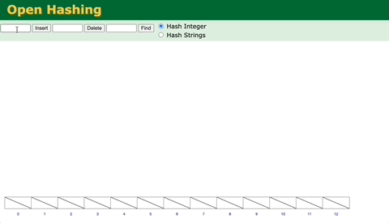
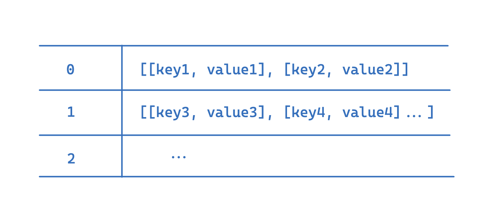

這是我在學習 Hash Table 這個資料結構時的筆記。

Hash Table 是什麼？Hash Table 是一種用來儲存鍵值對（ key-value pair ) 的資料結構，並且能夠讓我們用輸入的「鍵」值以非常快的速度來找到對應的資料。

Hash Table 在每個語言中都經常出現，在 JavaScript 中也是如此，只是通常我們不知道我們在用它而已，舉例來說，在 JavaScript 中，`Set` 和 `Map`，甚至是物件這幾種資料型別就運用了 Hash Table 的概念。

以下是一個 Hash Table 的結構範例 ([圖片出處](https://github.com/bradtraversy/traversy-js-challenges/blob/main/assets/images/hash-table.png))：


你可以從圖中看到左邊是鍵值，右邊是對應的值；而中間有一個 Hash Function，用於把每個不同的值放到 Table 上不同的對應位置。它會根據你輸入的鍵值來計算出不同的 Hash Table 上的位置，而且只要輸入的值不變，那麼 Hash Function 回傳的值應該也要維持一樣。

##  Hash Function

我們今天的重點將放在實作整個 Hash Map，因此 Hash Function 的實作並不是核心部分，這裡將以簡單的版本進行實作。在接下來的範例中，我們會用 Array 來儲存資料，然後我們會根據輸入的鍵值字串上對應的 Unicode 值來計算出 Hash Table 上的位置：
```js
function simpleHashKey(key, arraySize) {
  let hash = 0;
  for (let i = 0; i < key.length; i++) {
    hash += key.charCodeAt(i); // 把每個字符的 Unicode 值相加
  }
  return hash % arraySize; // 確保結果在陣列大小內
}

const arraySize = 10;

console.log(simpleHashKey("abc", arraySize)); // 6
console.log(simpleHashKey("xyz", arraySize)); // 8
console.log(simpleHashKey("a", arraySize));   // 7

```

## HashTable Class 
然後我們可以把這個 function 整合到 HashTable class 裡面，而除了 Hash Function 之外我們還需要 `set` / `get` 來新增和查找資料、也需要 keys 來查詢目前 Hash Table 上有哪些鍵值：
```js
class HashTable {
  constructor(size){
    this.data = new Array(size);
  }

  _hash(key) {
	  let hash = 0;
	  for (let i = 0; i < key.length; i++) {
	    hash += key.charCodeAt(i); // 把每個字符的 Unicode 值相加
	  }
	  return hash % size; // 確保結果在陣列大小內
  }
  set (){}
  get (){}
  keys(){}
}
```

## set Function 
要實作 `set` function，我們需要做兩個步驟：
-  set function 會有一個參數 key ，利用 Hash Function 找出對應在 Hash Table 上的儲存位置 （Index) 
- 把資料存入 Hash Table ，但要注意 Hash Collisions
```js
...
set(key, value){
	let address = this._hash(key);
	
}
...
```
### Hash Collisions


什麼是 Hash Collisions？就是當兩個不同的鍵值，在透過 Hash Function 計算之後，得出同樣的 Index，這樣的話就有可能會導致資料被覆蓋而遺失。關於碰撞的問題，[有很多種解決的辦法](https://en.wikipedia.org/wiki/Hash_table#Separate_chaining)，最常見的一種方法就是用 LinkedList 來確保可以有多筆資料對應到同一個 Index；

我們則是用更單純的 Array 來達成同樣的目的：


 
 透過這個方式， Hash Table 對應位置的資料永遠都會是 Array，所以我們透過把 `key`和 `value` 存到這個 Array 來避免因為碰撞而覆蓋資料的問題：
 
```js
set(key, value) {
  let address = this._hash(key); 
  if (!this.data[address]) {
    this.data[address] = []; // 如果地址是空的，創造一個陣列
  }
  
  this.data[address].push([key, value]);
  return this.data; 
}
```


## get Function 
 想要取得某個鍵值對應的資料，我們一樣要先用 `key` 值透過 Hash Function 去計算出對應位置。如果這個位置有儲存資料的話我們應該會取得一個陣列，接著我們只要在這個 Array 裡面去查找有沒有想要查詢的 `key` 被儲存在裡面，然後回傳對應的資料就好：

```js
...
get(key) {
  let address = this._hash(key); 
  const bucket = this.data[address]; // 取得該地址對應的陣列
  if (bucket) {
    // 遍歷陣列，尋找對應的 key
    for (let i = 0; i < bucket.length; i++) {
      if (bucket[i][0] === key) {
        return bucket[i][1]; // 返回對應 value
      }
    }
  }
  return 
}
...

```


## keys Function
`keys` 用來查詢所有儲存在這個 Hash Table 裡面的鍵值，透過實作這個 function 我們也能看出 Hash Table 的一個缺點，就是當要尋訪 Hash Table 所有儲存在 Hash Table 裡面的值時，為了避免忽略掉那些因為碰撞而儲存在 Hash Table 同樣位置的值，我們會需要第二層的 for loop 來逐個查詢，邏輯就會變得稍微複雜。


```js
...
keys() {
  const keysArray = [];
  // 遍歷整個資料結構
  for (let i = 0; i < this.data.length; i++) {
    if (this.data[i] && this.data[i].length) {
      // 如果該地址有值，遍歷鏈中的每個鍵值對
      for (let j = 0; j < this.data[i].length; j++) {
        keysArray.push(this.data[i][j][0]); // 最後一個 [0]用來取得 key
      }
    }
  }
  return keysArray; 
}
...
```

這樣我們就完成了一個基本的 HashTable，通常 HashTable 還會有其他像是 `delete` 以及 `values`等方法可以使用，不過前面這三個方法已經涵蓋了 Hash Table 的基本概念，在這邊就不再全部詳述。

以下是完整的 Hash Table 程式碼：

```js
class HashTable {
  constructor(size) {
    this.data = new Array(size);
  }

  _hash(key) {
    let hash = 0;
    for (let i = 0; i < key.length; i++) {
      hash += key.charCodeAt(i);
    }
    return hash % this.data.length;
  }

  set(key, value) {
    let address = this._hash(key);
    if (!this.data[address]) {
      this.data[address] = [];
    }
    for (let i = 0; i < this.data[address].length; i++) {
      if (this.data[address][i][0] === key) {
        this.data[address][i][1] = value;
        return this.data;
      }
    }
    this.data[address].push([key, value]);
    return this.data;
  }

  get(key) {
    let address = this._hash(key);
    const bucket = this.data[address];
    if (bucket) {
      for (let i = 0; i < bucket.length; i++) {
        if (bucket[i][0] === key) {
          return bucket[i][1];
        }
      }
    }
    return undefined;
  }

  keys() {
    const keysArray = [];
    for (let i = 0; i < this.data.length; i++) {
      if (this.data[i]) {
        for (let j = 0; j < this.data[i].length; j++) {
          keysArray.push(this.data[i][j][0]);
        }
      }
    }
    return keysArray;
  }
}

const myHashTable = new HashTable(10);
...
```

## 參考資源
 - https://github.com/bradtraversy/traversy-js-challenges/blob/main/06-hash-tables-maps-sets/02-hash-table-intro/readme.md
 - https://www.udemy.com/course/master-the-coding-interview-data-structures-algorithms
 - https://en.wikipedia.org/wiki/Hash_table
