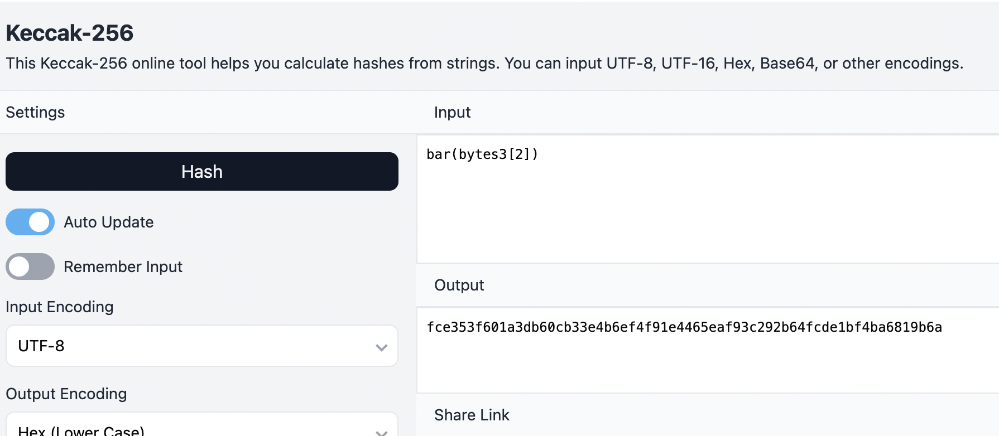

在一開始學習 Solidity 的時候，曾對 Function Selector 和 Function Signature 這個詞感到疑惑，不過仔細了解之後其實沒那麼抽象，這篇文章會解釋這兩個專有名詞的定義，以及衍生的相關問題。

## 什麼是 Function Selector ? 

在官方文件中有一段對 Function Selector 的解釋：

> The first four bytes of the call data for a function call specifies the function to be called. It is the first (left, high-order in big-endian) four bytes of the Keccak-256 hash of the signature of the function.


用白話一點的方式說，在 **Solidity** 中，每個函數都有一個**獨特的識別碼**，這個識別碼是用 function 本身的名稱加上特定格式（Function Signature，後面會說明），然後經過雜湊函式 [Keccak-256](https://dev.to/shlok2740/keccak256-in-solidity-433m) 計算出來的值，取其前 4 個 byte，就是 Function Selector

當你呼叫合約裡的一個函數時，Function Selector 會被放在**交易的前 4 個 byte（前 8 個 16 進制字符）**，讓 EVM 知道你要執行哪個函數，而大概就是因為 EVM 透過這個值來決定要執行哪個函數，所以它才被稱為 Function Selector。

## Function Signature

Function Signature 並不是 Solidity 才有的規範，他在許多語言裡面都用來讓 compiler 去區分不同的函式，以及函式的相關資訊。

> The signature is defined as the canonical expression of the basic prototype without data location specifier, i.e. the function name with the parenthesised list of parameter types. Parameter types are split by a single comma — no spaces are used.

這段是和前面引用的官方文件內容的後續段落，雖然文件上解釋得很抽象，不過卻對規範描述得很清楚。Function Signature 就是把你要執行的函式名稱加上括號，並在裡面列出其參數的型別，並中間以單引號隔開。

舉個例子，在下面這個合約中：

```solidity 
// SPDX-License-Identifier: GPL-3.0
pragma solidity >=0.4.16 <0.9.0;

contract Foo {
    function bar(bytes3[2] memory) public pure {}
    function baz(uint32 x, bool y) public pure returns (bool r) { r = x > 32 || y; }
}
```

如果我們要執行 Foo 合約上的 bar function ，我們的 Function Signature 就會長這樣 `bar(bytes3[2])`，而如果要執行 baz function ，則 Function Signature 就會是 `baz(uint32,bool)`.


## 計算 Function Selector



知道了什麼是 Function Signature 之後，我們要怎麼計算出 Function Selector 呢？其實過程很簡單，就照上面說的用 Function Signature 的值，經過 [Keccak-256 計算](https://emn178.github.io/online-tools/keccak_256.html?input=bar(bytes3%5B2%5D)&input_type=utf-8&output_type=hex)之後就會得到 `0xfce353f601a3d....` 這個結果，取其前 8 位數 `0xfce353f6` 就是 Function Selector。

## Function Selector Collision
Keccak-256 是一種雜湊函數，能將任何輸入經過計算後映射為固定長度的哈希值，而我們則取前面八位數作為 Function Selector；不過既然只取前八位數，那麼就會有一種情況是不同的輸入值，經過這個 Hash Funciton 計算之後的前八位數是一樣的。

不同的 Function Signature 得到同樣的 Function Selector ，這種情況就產生了 Function Selector Collision。雖然不能說是漏洞，不過這種可能性就很容易成為攻擊者下手的目標。所以如果撰寫合約（尤其是 proxy pattern，這部分如果未來有寫到 proxy 相關合約會再來說明）的時候要主意這個特性。

## "uint" And "uint256" Are Interchangeable ?
根據官方文件，在計算 Function Selector時，Function Signature 裡面的 `uint` 是會被轉換成 `uint256` 的。

``` solidity 
// SPDX-License-Identifier: GPL-3.0
pragma solidity >=0.4.16 <0.9.0;

contract Foo {
    function bar(bytes3[2] memory) public pure {}
    function baz(uint32 x, bool y) public pure returns (bool r) { r = x > 32 || y; }
    function sam(bytes memory, bool, uint[] memory) public pure {}
}
```

> `0xa5643bf2`: the Method ID. This is derived from the signature `sam(bytes,bool,uint256[])`. Note that `uint` is replaced with its canonical representation `uint256`.

所以假設你在合約上寫的 function name 是像上面說的 `function sam(bytes memory, bool, uint[] memory)` ，但是在呼叫這個 function 時你要知道用來呼叫他的對應的 function selector 必須要是由 `sam(bytes,bool,uint256[])` 經過 keccak256 雜湊函式計算過得到的值，而不是 `sam(bytes,bool,uint[])` ，否則就可能會因為呼叫錯誤的函式產生缺陷，或是漏洞。

這個行為產生的問題和上一段的 Function Selector Collision有一點不一樣，不過兩者都是因為產生錯誤的 Function Selector 而造成非預期的問題。而關於這個問題如果想要了解更多可以繼續閱讀這篇很棒的文章：

[Jackpot or Honeypot? A quick lesson on solc's uint and function selectors](https://medium.com/@mattaereal/jackpot-or-honeypot-a-quick-lesson-on-solcs-uint-and-function-selectors-cc1ea7f6afce)


## References
- https://docs.soliditylang.org/en/latest/contracts.html#
- [Function Selector Calculator](https://www.evm-function-selector.click/)
- [Function Selector Database](https://www.4byte.directory/)
- [How does the EVM resolve method ID collision?](https://ethereum.stackexchange.com/questions/46182/how-does-the-evm-resolve-method-id-collision)
- [Function selector collision in ERC165](https://ethereum.stackexchange.com/questions/133696/function-selector-collision-in-erc165)
- [Should UIs handle 4Byte function selector collisions?](https://ethereum.stackexchange.com/questions/40297/should-uis-handle-4byte-function-selector-collisions)
- https://forum.openzeppelin.com/t/beware-of-the-proxy-learn-how-to-exploit-function-clashing/1070
- https://github.com/AmazingAng/WTF-Solidity/blob/main/Languages/en/S02_SelectorClash_en/readme.md