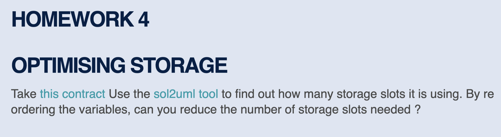
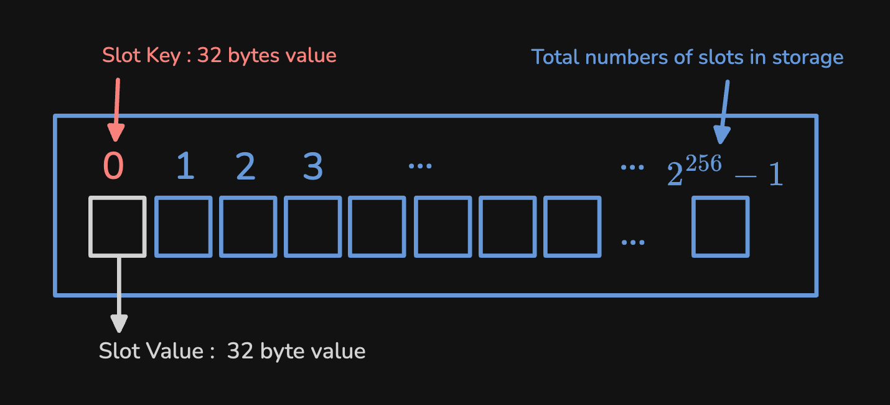
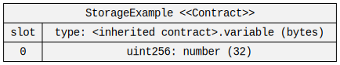
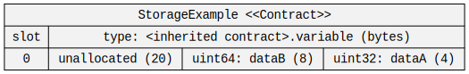
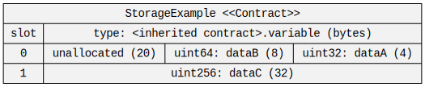
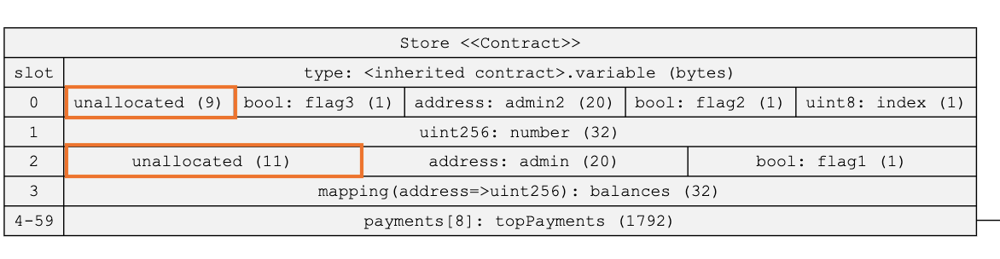
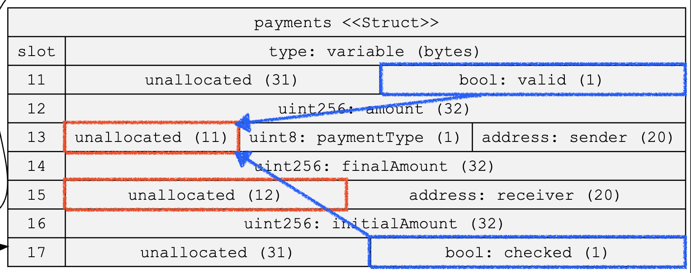
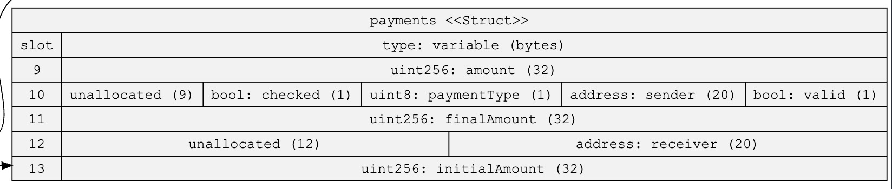

在參加 Encode Club 的第四天，我們[作業](https://solidity.bootcampnotes.xyz/homework4#/)的其中一個部分是想辦法用 [sol2uml](https://github.com/naddison36/sol2uml) 這個工具去觀察[一個合約內](https://gist.github.com/extropyCoder/6e9b5d5497b8ead54590e72382cdca24)Storage Slot 的使用情況，並且嘗試減少合約所使用的 Gas。




```solidity
contract Store {

    struct payments {
        bool valid;
        uint256 amount;
        address sender;
        uint8 paymentType;
        uint256 finalAmount;
        address receiver;
        uint256 initialAmount;
        bool checked;
    }
    uint8 index;
    uint256 public number;
    bool flag1;
    address admin;
    mapping (address=>uint256) balances;
    bool flag2;
    address admin2;
    bool flag3;
    payments[8] topPayments;
	...

```

所以在這篇文章裡面，我們會討論到合約上的資料是怎麼被儲存到 EVM 的 Storage 內的，以及怎麼盡可能減少 Storage 的使用量，以達到 Gas 優化的效果。

另外請注意這篇文章所做的優化只針對原始型別（Primitive Types），也就是 `uint`/`int` , `address`, `bytes` 類型的值。因為其他像是 struct 之類的 Reference Type，在 Storage 裡面的分配方式比較不一樣，所以會需要另外的篇幅來做探討。

## Outline

- EVM Storage Slots
- Why Optimize Storage Slots?
- How to Analyze Storage Slot  
- The Example In The Homework

## EVM Storage Slots


在智能合約中，每個合約都擁有自己的 Storage 空間。Storage 是由一組一組的 Key-Value 配對所組成，最多可以存放 2²⁵⁶ 筆資料。每組配對中，Key 用於查詢對應的資料，而 Value 則用於存放實際的數據（所以我們會把存放 Value 的空間稱為 Slot ），兩者都是 32 bytes 的大小。




## Why Optimize Storage Slots?
在 Gas 優化裡面，有一個常見且重要的做法是減少 Storage Slot 的使用量，這是因為讀取和寫入 Storage Slot 的成本都很高。特別是當首次寫入一個 Slot 時，Gas 的消耗量會比修改現有 Slot 高出許多，所以如果可以節省 Slot 的使用也就能夠減少部署和執行交易時讀取和寫入 Slot 所需要的 Gas。


## How to Analyze Storage Slot  
要知道怎麼節省使用的 Slot ，我們就要先了解資料是怎麼在 Storage 裡面被儲存的，首先我們知道每個 Slot 的長度是 32 byte ，也就是 256 bit 這麼長；再來我們要知道一件事：EVM 會試圖最大化利用每個 Storage Slot 的空間。

<Notation type="underline" color="yellow">  當一筆資料被放到一個 Slot 裡面之後，如果剩下的空間足夠用來存放下一筆資料，那麼 EVM 就會嘗試把兩筆資料放到同一個 Slot 之中。這個動作稱為「 [Slot Packing](https://noxx.substack.com/i/49905316/slot-packing)」，是由 Compiler 幫你完成的。</Notation>舉例來說，當我們儲存一筆 `uint32` 的資料，這筆資料會在一個 Slot 裡面佔據 4 byte 的長度。


```solidity 
contract StorageExample {
	uint32 dataA;
}
```

如果我們用 [sol2uml](https://github.com/naddison36/sol2uml) 這個工具來查看對應的 Storage Layout 的話，會長這樣（這個工具是在課程裡面學到的，對合約開發非常有幫助的工具）：



接著如果我們再這個變數後面再宣告一個 `uint64` 的變數 `dataB` 的話，你會看到 Storage Layout 會變成這樣：

```solidity 
contract StorageExample {
	uint32 dataA; 
	uint64 dataB; 
}
```



### Big-endian

你會發現 `dataB` 被放在與 `dataA` 一樣的 `slot0` 裡面，然後剩下 20 byte 的剩餘空間，所以只要是在這之後宣告的資料的大小小於 20 byte ，都一樣會被放在 `slot0` ，你還會發現這些宣告的資料都是靠右排列的，而不是靠左。

因爲在 EVM 中，資料的儲存方式有個特別的規則：<Notation type="underline" color="yellow">所有資料都會靠右邊排列。這就像是在一排格子中，新的資料會從右邊開始放，這種排列方式在電腦科學中有個專有名詞叫做 "[big-endian](https://docs.alchemy.com/docs/smart-contract-storage-layout#what-is-endian-ness)"（大端序），它主要影響像是文字（`string`）或是位元組（`byte`）這類資料的儲存方式。雖然名詞看起來很專業，但其實就是在描述「資料要從哪邊開始放」的規則而已。</Notation>


不過如果我們直接宣告一個 `uint256` 的資料 `dataC` ，那麼這個資料就會被存放在 `slot1` 裡面，因為 slot0 裡面沒有足夠的空間。


```solidity
contract StorageExample {
	uint32 dataA; 
	uint64 dataB; 
	uint256 dataC; 
}
```


  


## The Example In The Homework

現在回到我們開頭的作業提供的合約，可以看到在合約裡面最一開始宣告了一個 `struct`
型別的資料。不過我們可以先跳過 struct 的定義部分，因為 struct 的宣告只是定義了資料結構，並不會實際佔用 Storage Slot。
我們先來觀察一開始的一連串變數宣告：

```solidity
{

	struct payments {
        bool valid;
        uint256 amount;
        address sender;
        uint8 paymentType;
        uint256 finalAmount;
        address receiver;
        uint256 initialAmount;
        bool checked;
    }
		
	uint8 index;
    uint256 public number;
    bool flag1;
    address admin;
    mapping (address=>uint256) balances;
    bool flag2;
    address admin2;
    bool flag3;
    payments[8] topPayments;
	...
}
```
而上面這一串的型別宣告的 Storage Slot 長這樣：



我們可以看到 `slot0` 和 `slot2` 裡面各有一些未被分配資料的空間，不過看起來我們沒辦法透過把資料放到其他 Slot 來減少 Slot 的使用量。接著我們看到 `payments[8] topPayments` 這段 Struct Array 的宣告。

前面提到過 Reference Type 在 Storage 的儲存方式比較不一樣，他們會被儲存在另外的空間，不過這邊我們先專注在資料是如何被分配到 Slot。基本上，每個 Struct 裡面的資料還是會按照宣告的順序來進行 Slot 的分配，所以如果我們看一下 `payment` 的 Storage Layout  會長這樣：



很明顯的我們可以發現有兩個 Slot 其實都只使用了 1 個 byte ，所以我們只需要改變一下變數宣告的順序就能夠改變這兩筆 `bool` 值的分配位置。最終結果長這樣：

``` solidity
	struct payments {
        uint256 amount;
        bool valid;
        address sender;
        uint8 paymentType;
        bool checked;
        uint256 finalAmount;
        address receiver;
        uint256 initialAmount;
    }
```
 
 
##  Reference
- https://noxx.substack.com/p/evm-deep-dives-the-path-to-shadowy
- https://www.rareskills.io/post/evm-solidity-storage-layout
- https://eips.ethereum.org/EIPS/eip-2200
- https://docs.alchemy.com/docs/smart-contract-storage-layout