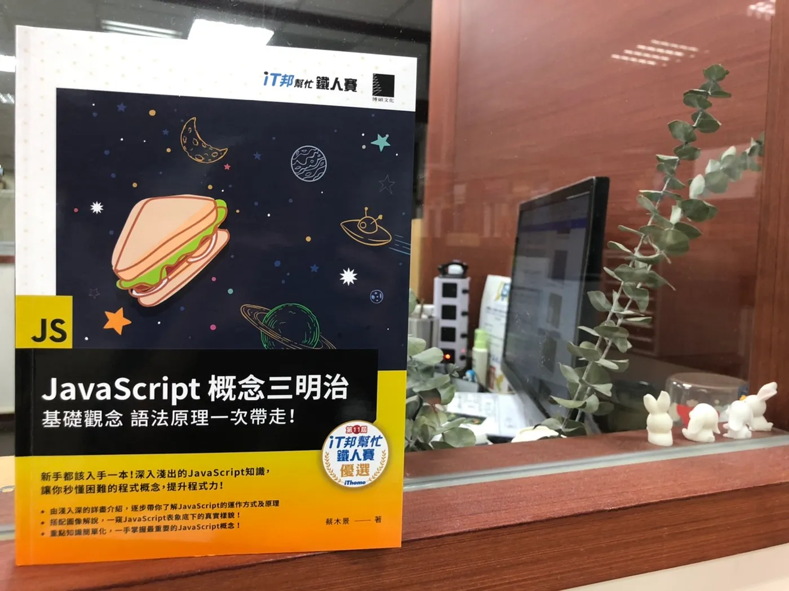

## How was this book born?
《JavaScript Concept Sandwich: Mastering Fundamentals and Syntax at a Glance》
("JavaScript 概念三明治：基礎觀念、語法原理一次帶走！" in Chinese)
is an extended work derived from my participation in the [ITHome Ironman Challenge](https://ithelp.ithome.com.tw/2019ironman).

This challenge is a technical writing competition where participants <Notation type="underline" color="yellow">must publish one technical article per day for 30 consecutive days</Notation> without interruption. 
My entry,
[The Awakening of JavaScript Force](https://ithelp.ithome.com.tw/users/20106580/ironman/2503),
focused on using flowcharts and diagrams to visualize the mechanics of JavaScript. This approach deepened my own understanding while aiming to help beginners grasp the language more effectively. Ultimately, my entry received a merit award.

## What's this book about? 

This book builds upon the content of my articles in the ITHome Ironman Challenge but has been significantly expanded and restructured. Only about 20% of the original series remains; the rest is newly curated and refined. 
<Notation type="bracket" color="yellow" strokeWidth="2">The book combines visuals and explanations to present JavaScript’s core concepts and syntax fundamentals in an accessible way.</Notation>

This was truly an incredible experience. Although the process was exhausting, it not only gave me a sense of accomplishment after the competition but also deepened my understanding of JavaScript as I completed and refined the articles into a complete book.