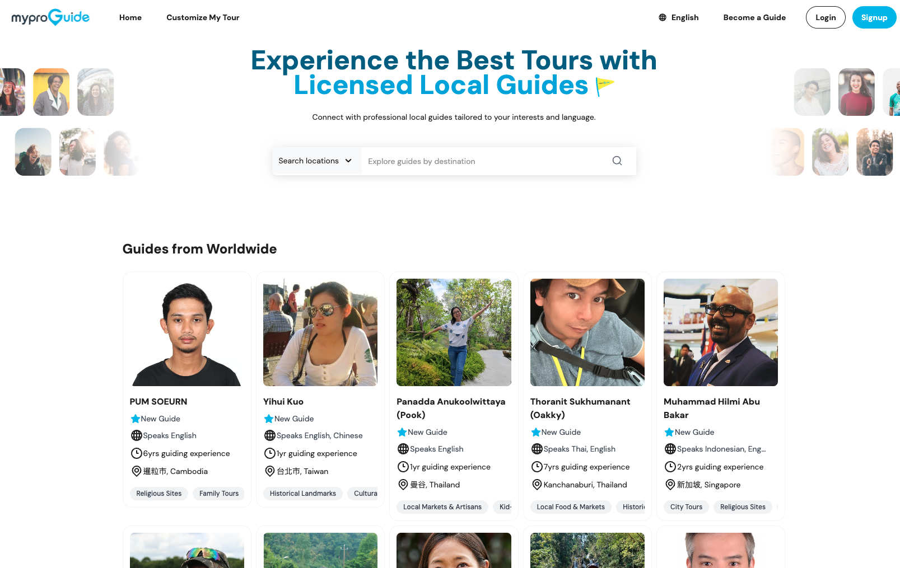
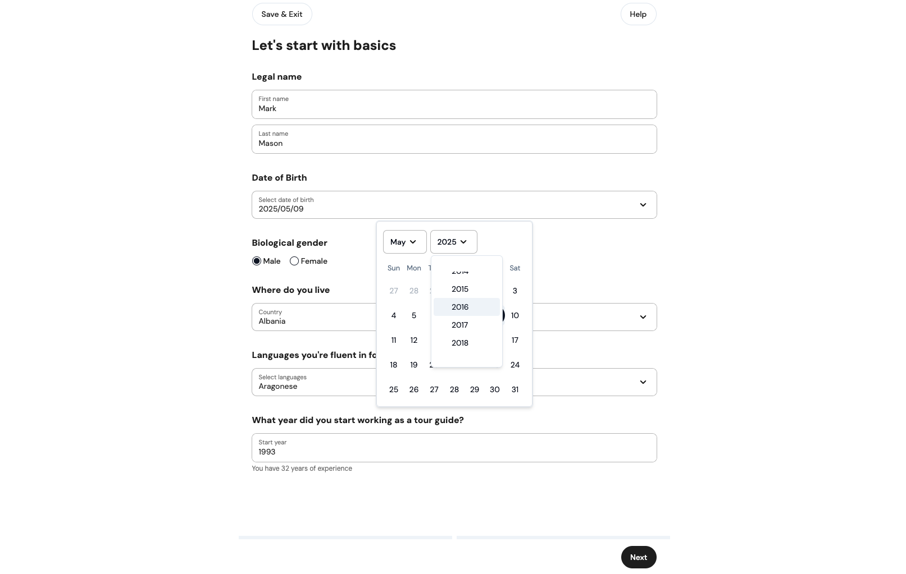

## Tech Stack

Nuxt / TypeScript / TailwindCSS / Cloudflare CDN / Cloudflare KV / SSR Caching

## Outcome & Takeaways

- <Notation type="underline" color="yellow">Improved homepage load time by 50%, significantly enhancing SEO score and reducing bounce rate.</Notation>
- <Notation type="underline" color="yellow">Boosted user retention by caching frequently accessed data with Cloudflare KV.</Notation>
- Achieved a **30% uplift in Lighthouse SEO score** by combining Nuxt SSR with client-side caching.
- <Notation type="underline" color="yellow">Integrated E2E testing to increase stability and ensure critical flows function reliably across deployments.</Notation>

## My Role in the Product

As a **Senior Frontend Developer (Part-Time)**,<Notation type="underline" color="yellow"> I led development of the project, applying edge caching, SSR refinements, and asset optimization to improve both perceived and actual speed.</Notation>  

I also introduced Storybook for more consistent and maintainable component development, and implemented E2E testing to safeguard the stability of critical user journeys.

These efforts not only strengthened the site’s technical foundation but also enabled the team to deliver features more confidently and efficiently.

## Core Features I Contributed To

### Homepage Performance Optimization

- Integrated **Cloudflare CDN** to serve static assets globally, reducing first-load latency.  
- Implemented client-side caching for static assets to speed up repeat visits and reduce unnecessary network requests.  
- Used Cloudflare KV edge storage to cache frequently accessed API data, cutting response times and improving performance for all users.

### Onboarding and Validation Flows for New Guides 

  - Comprehensive Validation Framework: Developed with Vuelidate and <Notation type="underline" color="yellow"> custom validators to ensure data integrity while preserving user flexibility. </Notation>
  - User-Friendly Experience: Designed intuitive forms with real-time validation feedback, enhancing user experience.
  - Persistent State Management: Implemented Pinia-based form state persistence that <Notation type="underline" color="yellow"> automatically saves user input
   across browser sessions </Notation>, preventing data loss from accidental navigation or page refreshes.
 

## What is MyProGuide?

[MyProGuide](https://myproguide.com) is a global travel platform connecting travelers with licensed tour guides and curated travel experiences.  
It provides a marketplace for booking guided tours, custom itineraries, and local activities, aiming to make travel planning more **personalized, authentic, and convenient**.  

The platform focuses on delivering a seamless user experience, reliable booking processes, and rich travel content to help travelers explore destinations with confidence.

## Key responsibilities:

- Delivered frontend performance optimizations for homepage and core travel planning flows.
- Implemented **CDN-based caching** and **edge storage** to serve content faster to global audiences.
- Refined SSR workflows to improve SEO and initial render performance.
- Collaborated with backend engineers and designers to ensure smooth integration of caching strategies and UI updates.