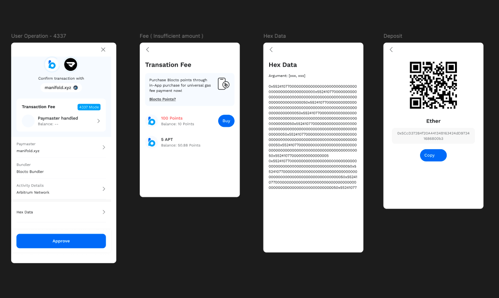

 
## Tech Stack

React / TypeScript / TailwindCSS / Xstate / Ethers.js / i18next / web3.js / Node.js

## Outcome & Takeaways
 
- <Notation type="underline" color="yellow">Reduced drop-off rate by 20% across login, transaction, and account switching flows.</Notation>
- Gained hands-on experience with ERC-4337 flows (UserOperation, paymaster).
- <Notation type="underline" color="yellow">Learned how to work with a large team and how to manage the state of the product with Xstate.</Notation>
- Helped scale wallet frontend to support 600K+ users across 5+ EVM chains.

## My Role in the Product

As a Frontend Engineer, I was responsible for key user-facing flows that made the multi-chain wallet experience seamless and intuitive. 
<Notation type="underline" color="yellow">I designed the account switching flow and integrated social login, making it easy for users to manage multiple accounts with consistent state across the UI and connected dApps.</Notation>
<Notation type="underline" color="yellow"> I also maintained the wallet's design system and worked closely with designers and backend engineers </Notation> to support complex workflows such as chain switching and transaction previews.
My contributions helped streamline wallet interactions, reduce user drop-off, and improve the reliability of core user journeys.

## Core Features I Contributed To
### Xstate state management

- Architected state management using XState to handle complex navigation and user flows, resulting in more maintainable code and easier debugging.
- Designed multiple error handling states with proper state transitions and recovery paths for different failure scenarios

###  Email & Social Login

- Designed & implemented the UI & state flow for email & social login.
- Integrated Social login with oauth flow like Google, Apple, etc.

### Transaction & Gas Estimation

- Enabled users to pay transaction fees using in-house points, replacing the traditional gas fees required by other wallets.
- Organized transaction data according to each chain's structure to ensure compatibility when sending transactions.
- Developed frontend interaction for visualizing multiple transactions before submission.
- Enabled users to preview gas costs and receive feedback in case of simulation errors.

### Chain & Account Switching

- Built user interface and state handling for EVM chain switching (e.g., from Ethereum to Arbitrum).
- Ensured consistency between on-screen account states and background session data.
- Supported use cases like adding new accounts and switching with active dApp connections.

## What is Blocto Wallet?

[Blocto](https://blocto.io/wallet) is a multi-chain smart contract wallet that is fully compatible with [ERC-4337](https://eips.ethereum.org/EIPS/eip-4337). It brings Account Abstraction to a wider audience by supporting gasless transactions, social login onboarding, and flexible key management. These features are designed to make Web3 as intuitive as Web2.

Blocto integrates with multiple blockchains, including Ethereum, Arbitrum, Polygon, BNB Chain, and Avalanche. It currently serves over 600,000 unique users across the ecosystem.

## Key responsibilities:
- Contributed to frontend development for multi-chain wallet architecture and core user flows.
- Collaborated with PM, designers and blockchain engineers to deliver scalable and user-friendly crypto wallet UIs.
- Designed feature flows and conducted comprehensive edge case analysis for critical user journeys.
- Enhanced product stability through strategic unit testing implementation.
- Drove design system implementation and maintained component consistency across products.

