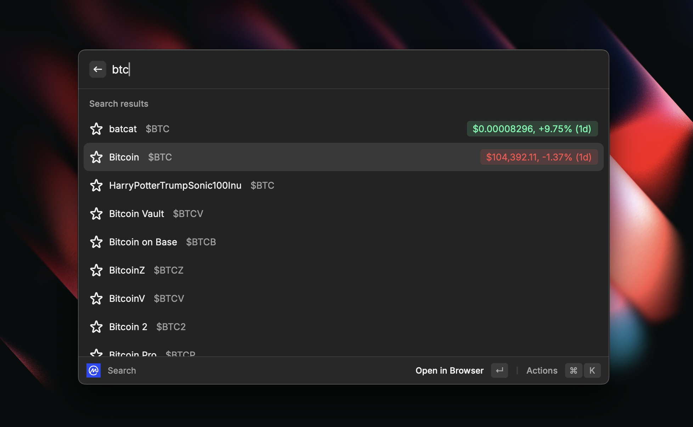
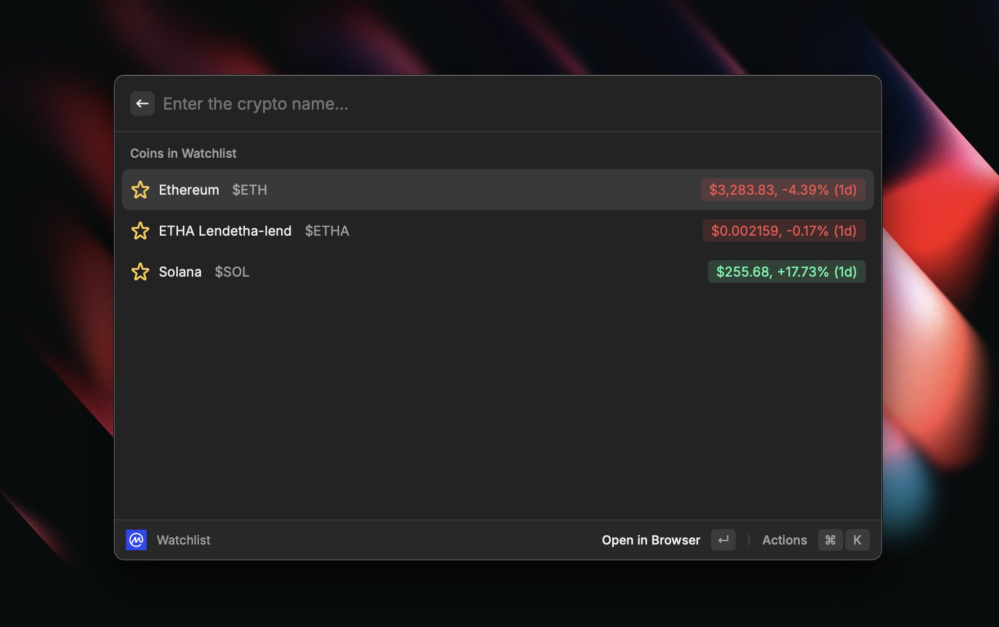
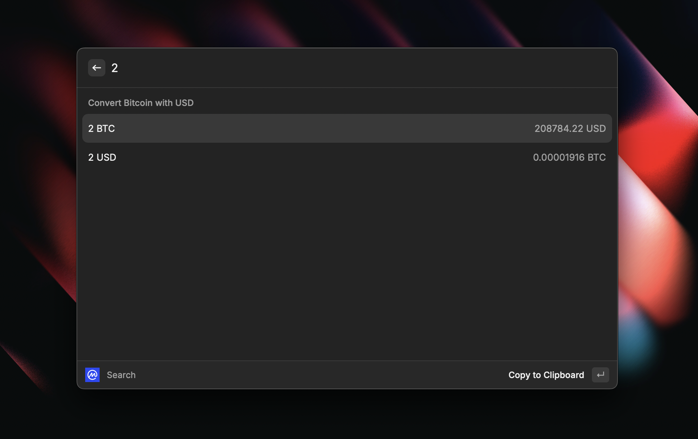

## What's Raycast?

Raycast is a quick launcher and toolset specifically designed for macOS, aimed at simplifying tasks and enhancing functionality to help users accomplish various tasks efficiently.
It's just like an enhanced version of Mac's built-in Spotlight tool.

## How This Extension Works

This extension allows you to quickly check cryptocurrency prices on Coinmarketcap. 
You can search by either the cryptocurrency's symbol or name.

When a matching cryptocurrency is found based on your query, a real-time web scraping process is triggered using Cheer.io to fetch the latest price from the Coinmarketcap website. 
The price is then displayed directly in Raycast.
 
You can also add frequently searched cryptocurrencies to a watchlist, enabling you to easily keep track of the prices of the cryptocurrencies you are most interested in.

 
 
 
 And this extension also comes with a currency converter, you can enter the amount of the currency you want to convert, and it will be converted to USD in real-time.

 